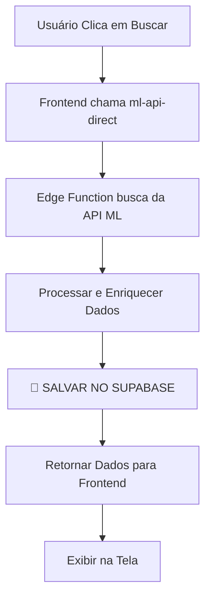

# 📊 BANCO DE DADOS DE DEVOLUÇÕES - EXPLICAÇÃO COMPLETA

## ✅ SIM, TODOS OS DADOS BUSCADOS SÃO SALVOS NO BANCO

### 🔄 Fluxo Atual de Dados



---

## 📦 O QUE É SALVO NO BANCO DE DADOS?

### Tabela: `pedidos_cancelados_ml`

**Todos os dados buscados da API do Mercado Livre são salvos**, incluindo:

#### 1️⃣ **Dados Básicos do Pedido**
- `order_id` - ID do pedido
- `claim_id` - ID da reclamação/devolução
- `status` - Status atual
- `date_created` - Data de criação
- `date_closed` - Data de fechamento
- `total_amount` - Valor total

#### 2️⃣ **Dados do Produto**
- `item_id` - ID do produto
- `item_title` - Título do produto
- `quantity` - Quantidade
- `sku` - SKU do produto
- `produto_warranty` - Garantia
- `produto_categoria` - Categoria
- `produto_thumbnail` - Imagem

#### 3️⃣ **Dados do Comprador**
- `buyer_id` - ID do comprador
- `buyer_nickname` - Apelido
- `buyer_email` - Email
- `buyer_phone` - Telefone
- `buyer_first_name` - Nome
- `buyer_last_name` - Sobrenome

#### 4️⃣ **Dados Financeiros**
- `custo_frete_devolucao` - Custo de frete
- `custo_logistica_total` - Custo de logística
- `valor_original_produto` - Valor original
- `valor_reembolsado_produto` - Valor reembolsado
- `taxa_ml_reembolso` - Taxa do ML
- `percentual_reembolsado` - Percentual

#### 5️⃣ **Rastreamento e Logística**
- `shipment_id` - ID do envio
- `codigo_rastreamento` - Código de rastreio
- `transportadora` - Transportadora
- `status_rastreamento` - Status
- `localizacao_atual` - Localização atual
- `tracking_history` - Histórico completo (JSONB)
- `tracking_events` - Eventos (JSONB)

#### 6️⃣ **Mensagens e Comunicação**
- `mensagens_nao_lidas` - Quantidade não lida
- `ultima_mensagem_data` - Data da última
- `timeline_mensagens` - Timeline completa (JSONB)
- `anexos_count` - Total de anexos
- `anexos_comprador` - Anexos do comprador (JSONB)
- `anexos_vendedor` - Anexos do vendedor (JSONB)

#### 7️⃣ **Análise e Classificação**
- `categoria_problema` - Categoria
- `subcategoria_problema` - Subcategoria
- `nivel_complexidade` - Alto/Médio/Baixo
- `nivel_prioridade` - Nível de prioridade
- `qualidade_comunicacao` - Score
- `eficiencia_resolucao` - Score

#### 8️⃣ **Mediação**
- `em_mediacao` - Boolean
- `resultado_mediacao` - Resultado
- `mediador_ml` - ID do mediador
- `escalado_para_ml` - Boolean

#### 9️⃣ **Dados de Reasons (Motivos)**
- `reason_id` - ID do motivo
- `reason_category` - Categoria
- `reason_name` - Nome
- `reason_detail` - Detalhes
- `reason_type` - Tipo
- `reason_priority` - Prioridade
- `reason_expected_resolutions` - Resoluções esperadas
- `reason_flow` - Fluxo

#### 🔟 **Marcos Temporais**
- `data_criacao_claim` - Data criação do claim
- `data_inicio_return` - Data início da devolução
- `data_fechamento_claim` - Data fechamento
- `data_vencimento_acao` - Data limite para ação
- `dias_restantes_acao` - Dias restantes

#### 1️⃣1️⃣ **Controle de Qualidade**
- `dados_completos` - Boolean
- `marketplace_origem` - Origem
- `internal_tags` - Tags internas (JSONB)
- `integration_account_id` - ID da conta de integração

---

## 🎯 PARA QUE SERVE O BANCO DE DADOS?

### 1. **📊 HISTÓRICO E AUDITORIA**
- Manter histórico completo de todas as devoluções
- Rastrear mudanças de status ao longo do tempo
- Compliance e auditoria de operações

### 2. **⚡ PERFORMANCE**
- **Busca instantânea** sem precisar chamar API ML sempre
- **Filtros avançados** localmente (mais rápido)
- **Paginação eficiente** sem limites da API
- **Reduz custos** de chamadas à API ML

### 3. **📈 ANÁLISES E RELATÓRIOS**
- Gerar relatórios de devoluções por período
- Identificar padrões de problemas
- Análise de custos com devoluções
- Métricas de qualidade de atendimento
- Dashboards gerenciais

### 4. **🔍 BUSCAS COMPLEXAS**
- Buscar por múltiplos critérios simultaneamente
- Filtros que a API ML não oferece
- Busca por texto em mensagens
- Filtros por valores calculados

### 5. **🔔 ALERTAS E AUTOMAÇÕES**
- Detectar devoluções que precisam ação urgente
- Notificações baseadas em regras
- Automações baseadas em padrões

### 6. **💾 BACKUP E RECUPERAÇÃO**
- Proteção contra perda de dados
- Recuperar dados caso API ML tenha problemas
- Dados históricos além do período da API

### 7. **🎨 ENRIQUECIMENTO DE DADOS**
- Adicionar notas internas
- Classificações personalizadas
- Status de processamento interno
- Tags e categorias customizadas

---

## ⚙️ COMO FUNCIONA O SALVAMENTO?

### Localização no Código
**Arquivo**: `supabase/functions/ml-api-direct/index.ts`
**Linhas**: 162-460

### Processo de Salvamento

```typescript
// 1. Buscar dados da API ML
const cancelledOrders = await buscarPedidosCancelados(...)

// 2. Preparar dados para inserção
const recordsToInsert = cancelledOrders.map(devolucao => ({
  order_id: devolucao.order_id,
  claim_id: devolucao.claim_id,
  // ... todos os ~150 campos
}))

// 3. UPSERT no banco (inserir ou atualizar)
await supabaseAdmin
  .from('pedidos_cancelados_ml')
  .upsert(recordsToInsert, {
    onConflict: 'order_id,integration_account_id',
    ignoreDuplicates: false
  })
```

### UPSERT significa:
- **Se o pedido JÁ EXISTE** (mesmo order_id + integration_account_id) → **ATUALIZA**
- **Se o pedido NÃO EXISTE** → **INSERE NOVO**

---

## 🚀 VANTAGENS DO SISTEMA ATUAL

### ✅ Vantagens
1. **Todos os dados são preservados** - Nada é perdido
2. **Busca offline** - Pode consultar sem internet da API
3. **Performance superior** - Dados locais são mais rápidos
4. **Análises poderosas** - SQL permite queries complexas
5. **Histórico completo** - Dados antigos sempre disponíveis
6. **Customização** - Adicionar campos próprios facilmente

### ⚠️ Pontos de Atenção
1. **Sincronização** - Dados do banco podem ficar desatualizados
2. **Espaço** - Precisa gerenciar crescimento da tabela
3. **Consistência** - Garantir que dados sejam atualizados periodicamente

---

## 📊 ESTATÍSTICAS DE DADOS

### Campos Salvos por Categoria

| Categoria | Campos | Descrição |
|-----------|--------|-----------|
| **Identificação** | 5 | IDs, controle |
| **Pedido** | 15 | Dados básicos do pedido |
| **Produto** | 12 | Informações do produto |
| **Comprador** | 10 | Dados do cliente |
| **Financeiro** | 18 | Valores, custos, reembolsos |
| **Logística** | 25 | Rastreamento, envio |
| **Mensagens** | 12 | Comunicação, anexos |
| **Análise** | 15 | Classificações, scores |
| **Mediação** | 8 | Dados de mediação |
| **Temporal** | 10 | Datas, prazos |
| **Reasons** | 8 | Motivos da devolução |
| **Metadados** | 12 | Tags, controle de qualidade |

**TOTAL**: ~150 campos sendo salvos por devolução

---

## 🔮 POSSIBILIDADES FUTURAS

Com o banco de dados alimentado, você pode:

1. **Dashboard Analytics** - Gráficos de tendências
2. **Previsão de Custos** - Machine Learning sobre histórico
3. **Alertas Inteligentes** - IA detectando padrões
4. **Integração ERP** - Sincronizar com outros sistemas
5. **Relatórios Customizados** - Excel, PDF automáticos
6. **API Própria** - Expor dados para outros sistemas
7. **Webhooks** - Notificações em tempo real

---

## 💡 RESUMO

**SIM**, todo dado buscado da API do Mercado Livre **É SALVO NO BANCO**.

O banco de dados serve como:
- 📚 **Repositório histórico completo**
- ⚡ **Cache de alta performance**
- 📊 **Motor de análises e relatórios**
- 🔍 **Sistema de busca avançada**
- 💾 **Backup e recuperação**
- 🎨 **Plataforma de enriquecimento**

**Benefício Principal**: Você não depende exclusivamente da API do ML - tem seus próprios dados, sempre disponíveis, para consultar, analisar e processar da forma que precisar.
