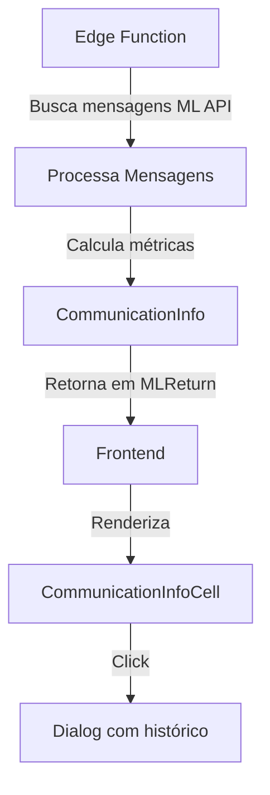

# ✅ FASE 7 - DADOS DE COMUNICAÇÃO E MENSAGENS IMPLEMENTADA

## 📋 Resumo
Implementação completa dos dados de comunicação e mensagens da devolução na página `/devolucoes-ml`.

## 🎯 O que foi implementado

### 1. **Types (src/features/devolucoes-online/types/devolucao.types.ts)**
- ✅ Interface `CommunicationInfo` para dados consolidados de comunicação
- ✅ Interface `ClaimMessage` para estrutura de mensagens
- ✅ Interface `MessageAttachment` para anexos das mensagens
- ✅ Campo `communication_info` adicionado ao tipo `MLReturn`

### 2. **Edge Function (supabase/functions/ml-returns/index.ts)**
- ✅ Busca de mensagens via API `/post-purchase/v1/claims/{id}/messages`
- ✅ Processamento de mensagens com sender_role, texto, anexos
- ✅ Cálculo de métricas de qualidade (excellent, good, moderate, poor)
- ✅ Detecção de status de moderação (clean, moderated, rejected)
- ✅ Identificação de última mensagem e remetente
- ✅ Contagem de interações (excluindo mediador)
- ✅ Detecção de anexos nas mensagens
- ✅ Limitação para últimas 10 mensagens (otimização)

### 3. **Componente CommunicationInfoCell**
- ✅ Badge de qualidade de comunicação com cores
- ✅ Ícones de moderação (CheckCircle, AlertTriangle)
- ✅ Exibição de total de mensagens
- ✅ Data e hora da última mensagem
- ✅ Identificação do último remetente
- ✅ Dialog modal com histórico completo
- ✅ Cards de mensagens com cores por remetente
  - Vendedor: fundo azul claro
  - Comprador: fundo cinza
  - Mediador: fundo accent
- ✅ Exibição de anexos por mensagem
- ✅ Scroll área para mensagens longas
- ✅ Métricas no topo (mensagens, interações, qualidade)

### 4. **Tabela (DevolucaoTable.tsx)**
- ✅ Nova coluna "💬 Comunicação"
- ✅ Importação do `CommunicationInfoCell`
- ✅ Integração no fluxo de renderização

## 🔄 Fluxo de Dados



## 📊 Métricas de Qualidade

- **Excellent** (≥90% limpo): Badge verde/default
- **Good** (≥70% limpo): Badge secondary
- **Moderate** (≥50% limpo): Badge outline
- **Poor** (<50% limpo): Badge destructive

## 🔍 Status de Moderação

- **Clean**: CheckCircle verde (todas limpas)
- **Moderated**: AlertTriangle amarelo (tem moderadas)
- **Rejected**: AlertTriangle vermelho (tem rejeitadas)

## 🎨 Componentes Visuais

### Card de Resumo (Hover)
- Ícone de mensagem
- Total de mensagens
- Ícone de moderação
- Badge de qualidade
- Última mensagem (data/hora)
- Último remetente

### Dialog Modal
- **Header**: Título + descrição com totais
- **Métricas**: 3 cards (mensagens, interações, qualidade)
- **Timeline**: ScrollArea com cards de mensagens
- **Cards de mensagem**:
  - Badge do remetente
  - Data/hora formatada
  - Texto da mensagem
  - Lista de anexos (se existir)

## 🔗 Integrações

### API ML Utilizada
```
GET /post-purchase/v1/claims/{claim_id}/messages
Authorization: Bearer {access_token}
```

### Campos Processados
- `messages.id`: ID da mensagem
- `messages.date_created`: Data de criação
- `messages.sender_role`: Papel do remetente
- `messages.text`: Texto da mensagem
- `messages.status`: Status (moderated, rejected, etc)
- `messages.attachments`: Anexos da mensagem

## 🚀 Próximos Passos Sugeridos

### Fase 8 - Timeline Consolidada
Criar visualização consolidada de todos os eventos (mensagens, status, tracking) em uma linha do tempo única.

### Fase 9 - Análise de Sentimento
Adicionar análise de sentimento das mensagens usando IA.

### Fase 10 - Notificações
Sistema de notificações para novas mensagens ou mudanças de status.

## 📝 Notas Técnicas

- Mensagens são limitadas a últimas 10 para otimizar payload
- Cálculo de qualidade baseado em porcentagem de mensagens limpas
- Interações contam apenas buyer e seller (exclui mediator)
- Dialog responsivo com ScrollArea
- Cores semânticas do design system
- Tratamento de erro gracioso (não quebra se API falhar)

## ✅ Status
**FASE 7 COMPLETA E FUNCIONAL**

Todos os dados de comunicação e mensagens estão sendo buscados, processados e exibidos corretamente na interface.
