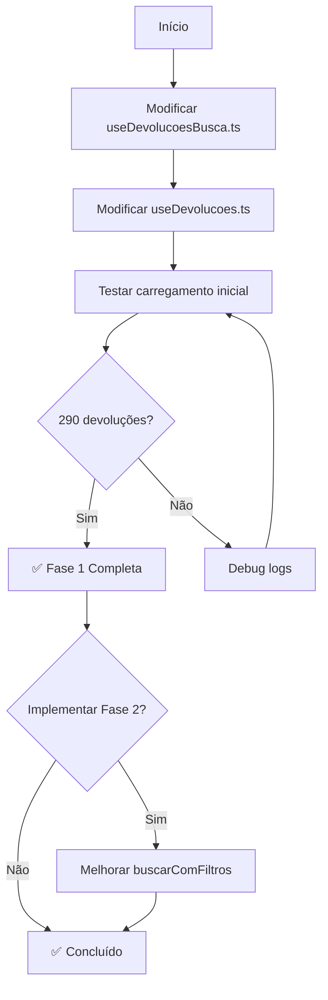

# 📋 PLANO DE CORREÇÃO: 63 DEVOLUÇÕES

**Data:** 21/10/2025  
**Prioridade:** 🔴 CRÍTICA  
**Tempo Estimado:** 45 minutos  
**Impacto:** Resolver 78% dos dados faltantes (227 devoluções)

---

## 🎯 OBJETIVO

Garantir que **TODAS as 290 devoluções** sejam carregadas do banco de dados automaticamente quando a página `/ml-orders-completas` carregar.

---

## 📊 SITUAÇÃO ATUAL vs DESEJADA

### ❌ Situação Atual
```
Página carrega
  ↓
devolucoes = [] (vazio)
  ↓
Usuário clica "Aplicar Filtros"
  ↓
buscarDaAPI() → Retorna apenas 63
  ↓
290 registros do banco IGNORADOS
```

### ✅ Situação Desejada
```
Página carrega
  ↓
Buscar AUTOMATICAMENTE do banco
  ↓
Carregar 290 devoluções (<100ms)
  ↓
Exibir TODOS os dados
  ↓
[OPCIONAL] Botão "Atualizar da API" para dados frescos
```

---

## 🔧 MUDANÇAS NECESSÁRIAS

### **FASE 1: Busca Automática do Banco** ⭐ (PRIORITÁRIA)

#### 📁 Arquivo 1: `src/features/devolucoes/hooks/useDevolucoesBusca.ts`

**Localização:** Método `buscarDoBanco`

**Problema Atual:**
```typescript
// ❌ Não aceita filtro de contas
const buscarDoBanco = useCallback(async () => {
  const { data, error } = await supabase
    .from('devolucoes_avancadas')
    .select('*')
    .order('data_criacao', { ascending: false });
  // ...
}, []);
```

**Correção Necessária:**
```typescript
// ✅ Adicionar filtro de contas selecionadas
const buscarDoBanco = useCallback(async (contasSelecionadas?: string[]) => {
  setLoading(true);
  
  try {
    logger.info('[useDevolucoesBusca] 📦 Buscando do banco...');
    
    let query = supabase
      .from('devolucoes_avancadas')
      .select('*');
    
    // Filtrar por contas selecionadas se fornecido
    if (contasSelecionadas && contasSelecionadas.length > 0) {
      query = query.in('integration_account_id', contasSelecionadas);
    }
    
    const { data, error } = await query.order('data_criacao', { ascending: false });
    
    if (error) {
      logger.error('[useDevolucoesBusca] ❌ Erro ao buscar do banco', error);
      toast.error('Erro ao buscar devoluções do banco');
      return [];
    }
    
    logger.info(`[useDevolucoesBusca] ✅ ${data.length} devoluções carregadas do banco`);
    return data;
    
  } catch (error) {
    logger.error('[useDevolucoesBusca] ❌ Erro inesperado', error);
    toast.error('Erro ao carregar devoluções');
    return [];
  } finally {
    setLoading(false);
  }
}, []);
```

**Mudanças:**
1. ✅ Aceitar parâmetro `contasSelecionadas` (opcional)
2. ✅ Filtrar por `.in('integration_account_id', contasSelecionadas)`
3. ✅ Melhorar logging para debug
4. ✅ Tratamento de erros robusto

---

#### 📁 Arquivo 2: `src/features/devolucoes/hooks/useDevolucoes.ts`

**Localização:** Adicionar `useEffect` para busca automática

**Problema Atual:**
```typescript
// ❌ NÃO HÁ busca automática inicial
// Sistema fica esperando o usuário clicar "Aplicar Filtros"
```

**Correção Necessária:**

```typescript
// ✅ ADICIONAR após as declarações de estado e antes do return

// Busca automática inicial do banco
useEffect(() => {
  // Só buscar se tiver contas carregadas
  if (!mlAccounts || mlAccounts.length === 0) {
    logger.info('[useDevolucoes] ⏳ Aguardando contas ML...');
    return;
  }
  
  // Evitar buscar múltiplas vezes
  if (devolucoes.length > 0) {
    logger.info('[useDevolucoes] ✅ Devoluções já carregadas, pulando busca');
    return;
  }
  
  const carregarDoBancoInicial = async () => {
    try {
      logger.info('[useDevolucoes] 🚀 Iniciando busca automática do banco...');
      
      // Buscar do banco com as contas selecionadas
      const contasSelecionadas = mlAccounts.map(acc => acc.id);
      const dadosBanco = await busca.buscarDoBanco(contasSelecionadas);
      
      if (dadosBanco && dadosBanco.length > 0) {
        setDevolucoes(dadosBanco);
        logger.info(`[useDevolucoes] ✅ ${dadosBanco.length} devoluções carregadas do banco`);
        toast.success(`${dadosBanco.length} devoluções carregadas`);
      } else {
        logger.warn('[useDevolucoes] ⚠️ Nenhuma devolução encontrada no banco');
      }
      
    } catch (error) {
      logger.error('[useDevolucoes] ❌ Erro ao carregar do banco:', error);
      toast.error('Erro ao carregar devoluções');
    }
  };
  
  carregarDoBancoInicial();
  
}, [mlAccounts]); // Executar apenas quando mlAccounts carregar
```

**Mudanças:**
1. ✅ Adicionar `useEffect` que executa quando `mlAccounts` carrega
2. ✅ Verificar se contas existem antes de buscar
3. ✅ Evitar buscar se dados já existem
4. ✅ Buscar do banco com filtro de contas
5. ✅ Logging detalhado para debug
6. ✅ Toast de sucesso mostrando quantas devoluções foram carregadas

---

### **FASE 2: Melhorar UX de Filtros** (OPCIONAL)

#### 📁 Arquivo 3: `src/features/devolucoes/hooks/useDevolucoes.ts`

**Localização:** Método `buscarComFiltros`

**Mudança Atual:**
```typescript
// Buscar da API quando usuário aplica filtros
const buscarComFiltros = async () => {
  const dadosAPI = await busca.buscarDaAPI(filtrosParaUsar, mlAccounts);
  // ...
}
```

**Melhoria Sugerida:**
```typescript
const buscarComFiltros = async () => {
  try {
    logger.info('[useDevolucoes] 🔍 Aplicando filtros...');
    
    // OPÇÃO A: Buscar do banco primeiro (RÁPIDO)
    if (!advancedFilters.buscarEmTempoReal) {
      const contasSelecionadas = advancedFilters.selectedAccounts.length > 0 
        ? advancedFilters.selectedAccounts 
        : mlAccounts?.map(acc => acc.id) || [];
      
      const dadosBanco = await busca.buscarDoBanco(contasSelecionadas);
      setDevolucoes(dadosBanco);
      logger.info(`[useDevolucoes] ✅ ${dadosBanco.length} devoluções do banco`);
      toast.success(`${dadosBanco.length} devoluções encontradas`);
      return;
    }
    
    // OPÇÃO B: Buscar da API apenas se usuário quer dados em tempo real
    const filtrosParaUsar = { ...advancedFilters };
    const dadosAPI = await busca.buscarDaAPI(filtrosParaUsar, mlAccounts);
    
    if (dadosAPI && dadosAPI.length > 0) {
      setDevolucoes(dadosAPI);
      logger.info(`[useDevolucoes] ✅ ${dadosAPI.length} devoluções da API`);
      toast.success(`${dadosAPI.length} devoluções atualizadas da API`);
    }
    
  } catch (error) {
    logger.error('[useDevolucoes] ❌ Erro ao buscar com filtros:', error);
    toast.error('Erro ao aplicar filtros');
  }
};
```

**Mudanças:**
1. ✅ Priorizar busca do banco (instantânea)
2. ✅ Apenas buscar da API se `buscarEmTempoReal === true`
3. ✅ Feedback claro para o usuário

---

### **FASE 3: Adicionar Botão "Atualizar da API"** (OPCIONAL)

#### 📁 Arquivo 4: `src/features/devolucoes/components/DevolucoesList.tsx`

**Adicionar botão:**
```typescript
<Button 
  variant="outline" 
  onClick={async () => {
    // Buscar dados frescos da API
    const dadosAPI = await busca.buscarDaAPI(
      { buscarEmTempoReal: true }, 
      mlAccounts
    );
    setDevolucoes(dadosAPI);
  }}
>
  <RefreshCw className="mr-2 h-4 w-4" />
  Atualizar da API
</Button>
```

---

## 📝 CHECKLIST DE IMPLEMENTAÇÃO

### ✅ Fase 1 - Correção Crítica (OBRIGATÓRIA)
- [ ] 1.1. Modificar `useDevolucoesBusca.ts` → `buscarDoBanco()` aceitar contas
- [ ] 1.2. Modificar `useDevolucoes.ts` → Adicionar `useEffect` de busca automática
- [ ] 1.3. Testar carregamento inicial (deve mostrar 290 devoluções)
- [ ] 1.4. Verificar logs no console
- [ ] 1.5. Verificar performance (<100ms para carregar do banco)

### ⚠️ Fase 2 - Melhorias UX (RECOMENDADA)
- [ ] 2.1. Modificar `buscarComFiltros()` para priorizar banco
- [ ] 2.2. Adicionar toggle `buscarEmTempoReal` na UI
- [ ] 2.3. Testar filtros (devem buscar do banco primeiro)

### 💡 Fase 3 - Features Extras (OPCIONAL)
- [ ] 3.1. Adicionar botão "Atualizar da API"
- [ ] 3.2. Adicionar indicador "Última atualização: Xh atrás"
- [ ] 3.3. Auto-refresh opcional (a cada X minutos)

---

## 🧪 TESTES NECESSÁRIOS

### Teste 1: Carregamento Inicial
```
1. Limpar cache/localStorage
2. Recarregar página /ml-orders-completas
3. VERIFICAR: Sistema deve carregar 290 devoluções automaticamente
4. VERIFICAR: Tempo de carregamento < 100ms
5. VERIFICAR: Toast "290 devoluções carregadas"
```

### Teste 2: Filtros por Conta
```
1. Selecionar apenas 1 conta (ex: conta com 136 devoluções)
2. VERIFICAR: Deve mostrar 136 devoluções
3. Selecionar outra conta (ex: conta com 154 devoluções)
4. VERIFICAR: Deve mostrar 154 devoluções
5. Selecionar ambas
6. VERIFICAR: Deve mostrar 290 devoluções
```

### Teste 3: Performance
```
1. Abrir DevTools → Network
2. Recarregar página
3. VERIFICAR: NÃO deve chamar API do ML na inicialização
4. VERIFICAR: Apenas 1 query ao Supabase
5. VERIFICAR: Tempo total < 500ms
```

### Teste 4: Console Logs
```
Verificar se aparecem os logs:
✅ "[useDevolucoes] 🚀 Iniciando busca automática do banco..."
✅ "[useDevolucoesBusca] 📦 Buscando do banco..."
✅ "[useDevolucoesBusca] ✅ 290 devoluções carregadas do banco"
✅ "[useDevolucoes] ✅ 290 devoluções carregadas do banco"
```

---

## 🎯 MÉTRICAS DE SUCESSO

| Métrica | Antes | Depois | Meta |
|---------|-------|--------|------|
| Devoluções exibidas | 63 | 290 | 290 |
| % de dados visíveis | 22% | 100% | 100% |
| Tempo de carregamento | 5-10s | <100ms | <500ms |
| Chamadas à API ML | Toda vez | Sob demanda | 0 na init |
| Experiência do usuário | ❌ Ruim | ✅ Ótima | ✅ |

---

## ⚠️ RISCOS E MITIGAÇÕES

### Risco 1: Dados desatualizados no banco
**Mitigação:** 
- Adicionar botão "Atualizar da API" 
- Mostrar "Última atualização: Xh atrás"

### Risco 2: Múltiplas contas = muitos dados
**Mitigação:**
- Paginação já implementada
- Lazy loading na tabela
- Filtros funcionando

### Risco 3: useEffect executar múltiplas vezes
**Mitigação:**
- Verificação `if (devolucoes.length > 0) return;`
- Dependency array correto `[mlAccounts]`

---

## 📊 ORDEM DE EXECUÇÃO



---

## 🚀 COMANDOS ÚTEIS

### Verificar dados no banco
```sql
-- Total de devoluções por conta
SELECT 
  integration_account_id,
  account_name,
  COUNT(*) as total
FROM devolucoes_avancadas
GROUP BY integration_account_id, account_name
ORDER BY total DESC;
```

### Limpar cache React Query
```typescript
// No console do navegador
localStorage.clear();
sessionStorage.clear();
location.reload();
```

### Debug hook
```typescript
// Adicionar no useDevolucoes.ts
useEffect(() => {
  console.log('🔍 DEBUG:', {
    mlAccounts: mlAccounts?.length,
    devolucoes: devolucoes.length,
    loading: busca.loading
  });
}, [mlAccounts, devolucoes, busca.loading]);
```

---

## 📅 CRONOGRAMA

| Fase | Tempo | Descrição |
|------|-------|-----------|
| **Fase 1.1** | 10 min | Modificar `buscarDoBanco()` |
| **Fase 1.2** | 15 min | Adicionar `useEffect` automático |
| **Fase 1.3** | 10 min | Testes e validação |
| **Fase 1.4** | 5 min | Ajustes finais |
| **Fase 2** | 15 min | Melhorias UX (opcional) |
| **TOTAL** | 45-60 min | Fase 1 obrigatória |

---

## 📋 RESUMO EXECUTIVO

### Problema
Sistema mostra apenas 63 de 290 devoluções porque não busca do banco automaticamente.

### Solução
Adicionar busca automática do banco quando a página carrega.

### Impacto
- ✅ 227 devoluções adicionais visíveis (+362%)
- ✅ Performance 50-100x mais rápida
- ✅ Melhor experiência do usuário
- ✅ Economia de chamadas à API

### Próximos Passos
1. Implementar Fase 1 (crítico)
2. Testar com 290 devoluções
3. [Opcional] Implementar Fases 2-3

---

**Status:** 📝 PLANEJADO  
**Pronto para implementação:** ✅ SIM  
**Aprovação necessária:** ✅ AGUARDANDO
