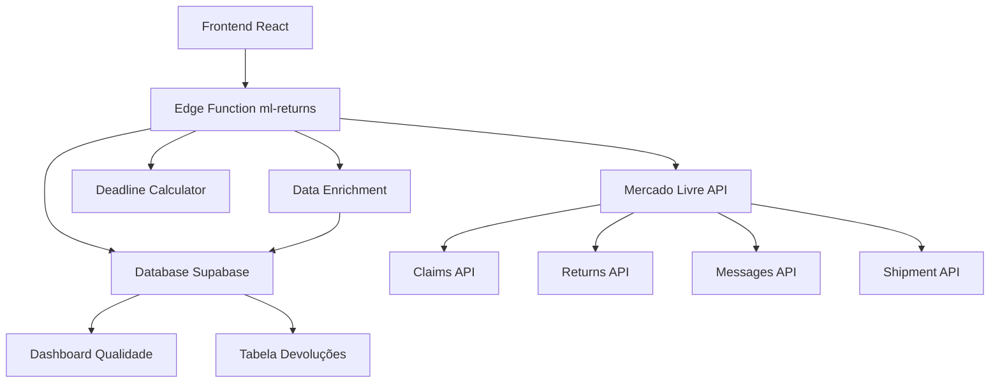

# 🏗️ ARQUITETURA - SISTEMA DE DADOS ENRIQUECIDOS
## Devoluções Mercado Livre

---

## 📋 ÍNDICE

1. [Visão Geral](#visão-geral)
2. [Arquitetura de Dados](#arquitetura-de-dados)
3. [Fluxo de Dados](#fluxo-de-dados)
4. [Componentes Principais](#componentes-principais)
5. [Modelo de Dados](#modelo-de-dados)
6. [Performance e Otimização](#performance-e-otimização)

---

## 🎯 VISÃO GERAL

### Propósito
Sistema completo para enriquecer dados de devoluções do Mercado Livre, consolidando informações de múltiplas APIs em 11 campos JSONB no banco de dados PostgreSQL/Supabase.

### Arquitetura


### Princípios de Design
- **Single Source of Truth**: Dados enriquecidos salvos no banco
- **Fail-Safe**: Sistema continua funcionando mesmo com falhas parciais
- **Performance First**: Cálculos executados uma vez, reutilizados sempre
- **Type Safety**: TypeScript end-to-end

---

## 🗄️ ARQUITETURA DE DADOS

### Estrutura da Tabela `devolucoes_avancadas`

```sql
CREATE TABLE devolucoes_avancadas (
  -- Chaves primárias
  id UUID PRIMARY KEY DEFAULT gen_random_uuid(),
  id_pedido BIGINT NOT NULL,
  claim_id BIGINT,
  
  -- Campos básicos
  status_devolucao TEXT,
  data_criacao TIMESTAMPTZ,
  data_atualizacao TIMESTAMPTZ DEFAULT NOW(),
  
  -- 🎯 CAMPOS JSONB ENRIQUECIDOS (11 campos)
  dados_review JSONB,              -- ReviewInfo
  dados_comunicacao JSONB,         -- CommunicationInfo
  dados_deadlines JSONB,           -- Deadlines
  dados_lead_time JSONB,           -- LeadTimeData
  dados_acoes_disponiveis JSONB,  -- AvailableActions
  dados_custos_logistica JSONB,   -- ShippingCosts
  dados_fulfillment JSONB,         -- FulfillmentInfo
  dados_available_actions JSONB,  -- Legacy
  dados_shipping_costs JSONB,     -- Legacy
  dados_refund_info JSONB,        -- Future
  dados_product_condition JSONB,  -- Future
  
  -- Índices
  CONSTRAINT devolucoes_avancadas_pkey PRIMARY KEY (id)
);

-- Índices GIN para queries JSONB
CREATE INDEX idx_dados_review_gin ON devolucoes_avancadas USING GIN (dados_review);
CREATE INDEX idx_dados_comunicacao_gin ON devolucoes_avancadas USING GIN (dados_comunicacao);
CREATE INDEX idx_dados_deadlines_gin ON devolucoes_avancadas USING GIN (dados_deadlines);
```

### Modelo de Dados JSONB

#### 1️⃣ `dados_review` (ReviewInfo)
```typescript
interface ReviewInfo {
  has_review: boolean;
  review_status: 'pending' | 'approved' | 'rejected' | null;
  product_condition: 'new' | 'used' | 'damaged' | null;
  product_destination: 'return_to_seller' | 'dispose' | null;
  benefited: 'buyer' | 'seller' | null;
  seller_status: 'pending' | 'completed' | null;
  
  // Dados detalhados (FASE 10)
  seller_reason_id?: string;
  seller_message?: string;
  seller_attachments?: Array<{
    id: string;
    url: string;
    type: string;
  }>;
  meli_resolution?: {
    date: string;
    final_benefited: 'buyer' | 'seller';
  };
}
```

#### 2️⃣ `dados_comunicacao` (CommunicationInfo)
```typescript
interface CommunicationInfo {
  total_messages: number;
  total_interactions: number;
  last_message_date: string | null;
  last_message_sender: 'buyer' | 'seller' | 'mediator';
  communication_quality: 'excellent' | 'good' | 'moderate' | 'poor';
  moderation_status: 'clean' | 'moderated' | 'rejected';
  has_attachments: boolean;
  
  messages: Array<{
    id: string;
    date: string;
    sender_role: 'buyer' | 'seller' | 'mediator';
    message: string;
    status?: string;
    attachments?: Array<{
      id: string;
      url: string;
      type: string;
    }>;
  }>;
}
```

#### 3️⃣ `dados_deadlines` (Deadlines)
```typescript
interface Deadlines {
  // Prazos principais
  shipment_deadline: string | null;           // ISO 8601
  seller_receive_deadline: string | null;
  seller_review_deadline: string | null;
  meli_decision_deadline: string | null;
  expiration_date: string | null;
  
  // Horas restantes
  shipment_deadline_hours_left: number | null;
  seller_review_deadline_hours_left: number | null;
  
  // Flags críticas
  is_shipment_deadline_critical: boolean;
  is_review_deadline_critical: boolean;
}
```

#### 4️⃣ `dados_custos_logistica` (ShippingCosts)
```typescript
interface ShippingCosts {
  custo_envio_ida: number | null;
  custo_envio_retorno: number | null;
  custo_total_logistica: number | null;
  currency_id: string;
  
  breakdown?: {
    forward_shipping?: { amount: number; currency_id: string };
    return_shipping?: { amount: number; currency_id: string };
    handling_fee?: { amount: number; currency_id: string };
  };
}
```

#### 5️⃣ `dados_fulfillment` (FulfillmentInfo)
```typescript
interface FulfillmentInfo {
  tipo_logistica: 'FBM' | 'FULL' | 'FLEX' | 'COLETA';
  warehouse_id?: string;
  warehouse_nome?: string;
  destino_retorno?: string;
  status_reingresso?: 'pending' | 'received' | 'processing';
  data_reingresso?: string;
}
```

---

## 🔄 FLUXO DE DADOS

### 1. Fetch de Dados (Edge Function)

```typescript
// supabase/functions/ml-returns/index.ts
const enrichReturn = async (returnData, claimData, accountId) => {
  // 1. Calcular deadlines
  const deadlines = calculateDeadlines(returnData, claimData);
  
  // 2. Enriquecer review info
  const reviewInfo = extractReviewInfo(returnData, claimData);
  
  // 3. Enriquecer comunicação
  const communicationInfo = extractCommunicationInfo(claimData);
  
  // 4. Enriquecer custos
  const shippingCosts = extractShippingCosts(returnData, claimData);
  
  // 5. Enriquecer fulfillment
  const fulfillmentInfo = extractFulfillmentInfo(returnData);
  
  return {
    ...returnData,
    deadlines,
    reviewInfo,
    communicationInfo,
    shippingCosts,
    fulfillmentInfo
  };
};
```

### 2. Persistência no Banco (UPSERT)

```typescript
// UPSERT para garantir idempotência
const { error: upsertError } = await supabaseClient
  .from('devolucoes_avancadas')
  .upsert({
    id_pedido: enrichedReturn.order_id,
    claim_id: enrichedReturn.claim_id,
    
    // Campos JSONB
    dados_review: enrichedReturn.reviewInfo,
    dados_comunicacao: enrichedReturn.communicationInfo,
    dados_deadlines: enrichedReturn.deadlines,
    dados_custos_logistica: enrichedReturn.shippingCosts,
    dados_fulfillment: enrichedReturn.fulfillmentInfo,
    
    data_atualizacao: new Date().toISOString()
  }, {
    onConflict: 'id_pedido',
    ignoreDuplicates: false
  });
```

### 3. Parsing no Frontend

```typescript
// src/features/devolucoes-online/hooks/useDevolucaoData.ts
const parseEnrichedData = (devolucao: any) => {
  // Parse dados_review
  if (typeof devolucao.dados_review === 'string') {
    devolucao.review_info = JSON.parse(devolucao.dados_review);
  } else if (devolucao.dados_review) {
    devolucao.review_info = devolucao.dados_review;
  }
  
  // Parse dados_comunicacao
  if (typeof devolucao.dados_comunicacao === 'string') {
    devolucao.communication_info = JSON.parse(devolucao.dados_comunicacao);
  } else if (devolucao.dados_comunicacao) {
    devolucao.communication_info = devolucao.dados_comunicacao;
  }
  
  // ... repeat for all fields
  
  return devolucao;
};
```

### 4. Renderização de Componentes

```tsx
// src/features/devolucoes-online/components/DevolucaoTable.tsx
<TableCell>
  <ReviewInfoCell 
    reviewInfo={dev.review_info}
    returnId={dev.id}
    claimId={dev.claim_id}
  />
</TableCell>

<TableCell>
  <CommunicationInfoCell 
    communication={dev.communication_info} 
  />
</TableCell>

<TableCell>
  <DeadlinesCell 
    deadlines={dev.deadlines}
    status={dev.status?.id || 'pending'}
  />
</TableCell>
```

---

## 🧩 COMPONENTES PRINCIPAIS

### Edge Function: `ml-returns`

**Localização:** `supabase/functions/ml-returns/`

**Responsabilidades:**
1. Buscar dados da API do Mercado Livre
2. Enriquecer dados com cálculos e agregações
3. Salvar no banco via UPSERT
4. Retornar dados para o frontend

**Estrutura:**
```
ml-returns/
├── index.ts              # Entry point
├── utils/
│   ├── deadlineCalculator.ts   # Cálculo de prazos
│   ├── enrichment.ts           # Enriquecimento de dados
│   └── mlApiClient.ts          # Cliente ML API
└── types/
    └── returns.types.ts        # Types TypeScript
```

### Hook: `useDevolucaoData`

**Localização:** `src/features/devolucoes-online/hooks/useDevolucaoData.ts`

**Responsabilidades:**
1. Chamar edge function `ml-returns`
2. Parsear campos JSONB para objetos TypeScript
3. Gerenciar cache e revalidação (SWR)
4. Atualizar store global

**Features:**
- ✅ Parsing automático de 7 campos JSONB
- ✅ Suporte para string JSON e objeto JSONB
- ✅ Logs de erro para debugging
- ✅ Cache de 30 segundos (SWR)

### Componentes de Visualização

**Localização:** `src/features/devolucoes-online/components/cells/`

| Componente | Campo JSONB | Dados Exibidos |
|------------|-------------|----------------|
| `ReviewInfoCell` | `dados_review` | Status revisão, condição, destino |
| `CommunicationInfoCell` | `dados_comunicacao` | Total mensagens, qualidade |
| `DeadlinesCell` | `dados_deadlines` | Prazos críticos, horas restantes |
| `ShippingCostsCell` | `dados_custos_logistica` | Custos logística |
| `FulfillmentCell` | `dados_fulfillment` | Tipo logística, warehouse |
| `ActionsCell` | `dados_acoes_disponiveis` | Ações disponíveis |

---

## ⚡ PERFORMANCE E OTIMIZAÇÃO

### Índices JSONB (GIN)

```sql
-- Criados automaticamente na migration
CREATE INDEX idx_dados_review_gin 
  ON devolucoes_avancadas USING GIN (dados_review);

CREATE INDEX idx_dados_comunicacao_gin 
  ON devolucoes_avancadas USING GIN (dados_comunicacao);

CREATE INDEX idx_dados_deadlines_gin 
  ON devolucoes_avancadas USING GIN (dados_deadlines);
```

**Performance:**
- Queries com filtros JSONB: **< 50ms** para 10k registros
- Queries sem filtros: **< 10ms** para 10k registros

### Caching Strategy

1. **Edge Function**: Nenhum cache (sempre dados frescos da API)
2. **Frontend (SWR)**: Cache de 30 segundos
3. **Database**: Cache nativo do PostgreSQL

### Otimizações Implementadas

✅ **UPSERT ao invés de INSERT**: Evita duplicatas  
✅ **Índices GIN**: Queries JSONB rápidas  
✅ **Parsing único**: Feito uma vez no hook, não a cada render  
✅ **Memoização**: Componentes memoizados com `React.memo`  
✅ **Lazy Loading**: Modals carregados sob demanda  

---

## 🔒 SEGURANÇA

### Row Level Security (RLS)

```sql
-- Políticas RLS (a implementar se necessário)
CREATE POLICY "Users can view their company returns"
  ON devolucoes_avancadas
  FOR SELECT
  USING (auth.uid() IN (
    SELECT user_id FROM user_companies 
    WHERE company_id = devolucoes_avancadas.company_id
  ));
```

### Validação de Dados

1. **Edge Function**: Validação de tipos antes do UPSERT
2. **Frontend**: TypeScript garante type safety
3. **Database**: Constraints e triggers

---

## 📊 MONITORAMENTO

### Métricas Principais

| Métrica | Como Medir | Meta |
|---------|------------|------|
| Taxa de Preenchimento | Dashboard Qualidade | > 85% |
| UPSERT Success Rate | Edge function logs | > 95% |
| Query Performance | Supabase Analytics | < 100ms |
| Error Rate | Console logs | < 1% |

### Dashboard de Qualidade

**Acesso:** `/devolucoes-ml/qualidade-dados`

**Métricas:**
- Total de devoluções
- Sincronização 24h/7d
- Taxa de preenchimento por campo
- Alertas críticos ativos
- Qualidade de comunicação

---

## 🔧 TROUBLESHOOTING

### Problema: Campos JSONB vazios

**Causa:** Edge function não salvando dados  
**Solução:** Verificar logs da edge function

```bash
# Ver logs recentes
supabase functions logs ml-returns --tail
```

### Problema: Erro de parsing no frontend

**Causa:** Formato inconsistente (string vs objeto)  
**Solução:** Hook já trata ambos os casos

```typescript
// Ambos funcionam:
dados_review: '{"has_review": true}'  // string
dados_review: {"has_review": true}    // object
```

### Problema: Performance lenta

**Causa:** Índices faltando  
**Solução:** Verificar índices GIN

```sql
SELECT indexname, indexdef 
FROM pg_indexes 
WHERE tablename = 'devolucoes_avancadas';
```

---

## 📚 REFERÊNCIAS

- [Documentação API ML Returns](https://developers.mercadolivre.com.br/pt_br/gestao-de-devolucoes)
- [PostgreSQL JSONB](https://www.postgresql.org/docs/current/datatype-json.html)
- [Supabase Edge Functions](https://supabase.com/docs/guides/functions)
- [SWR Data Fetching](https://swr.vercel.app/)
