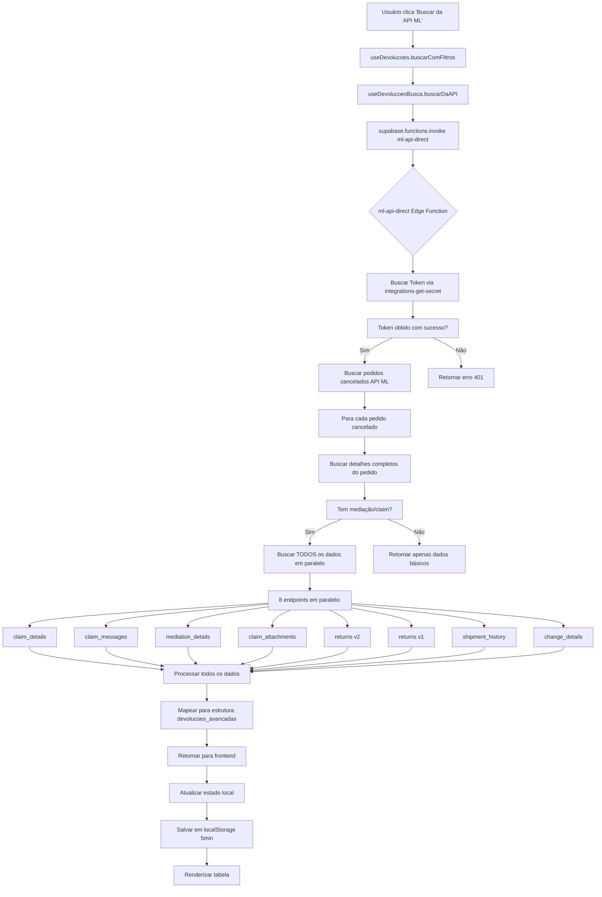

# 📋 ARQUITETURA COMPLETA - /ml-orders-completas

## 🎯 VISÃO GERAL

Página dedicada ao **Sistema de Devoluções Avançadas do Mercado Livre**, permitindo buscar, visualizar e gerenciar pedidos cancelados e devoluções com dados enriquecidos da API ML.

---

## 📁 ESTRUTURA DE ARQUIVOS

### **Frontend**
```
src/pages/MLOrdersCompletas.tsx                    # Página principal
src/components/ml/DevolucaoAvancadasTab.tsx        # Componente da aba de devoluções
src/components/ml/devolucao/                       # Componentes modulares
  ├── DevolucaoStatsCards.tsx                      # Cards de estatísticas
  ├── DevolucaoFilters.tsx                         # Filtros
  ├── DevolucaoToolbar.tsx                         # Barra de ferramentas
  ├── DevolucaoTable.tsx                           # Tabela de devoluções
  ├── DevolucaoDetailsModal.tsx                    # Modal de detalhes
  └── DevolucaoPagination.tsx                      # Paginação
```

### **Hooks Principais**
```
src/hooks/usePersistentMLOrdersState.ts            # Persistência de estado (5min cache)
src/features/devolucoes/hooks/
  ├── useDevolucoes.ts                             # Hook principal consolidado
  ├── useDevolucoesBusca.ts                        # Busca na API ML
  ├── useDevolucoesPersistence.ts                  # Persistência avançada
  ├── useDevolucaoAnalytics.ts                     # Analytics
  └── useDevolucaoExportacao.ts                    # Exportação
```

### **Edge Functions (Backend)**
```
supabase/functions/ml-api-direct/index.ts          # Busca direta na API ML
supabase/functions/devolucoes-avancadas-sync/      # Sincronização e enriquecimento
supabase/functions/integrations-get-secret/        # Gerenciamento de tokens
```

### **Banco de Dados**
```
Tabela: devolucoes_avancadas                       # ~150 colunas de dados enriquecidos
Tabela: integration_accounts                       # Contas ML conectadas
Tabela: integration_secrets                        # Tokens seguros (criptografados)
```

---

## 🔄 FLUXO DE DADOS COMPLETO

### **1. INICIALIZAÇÃO DA PÁGINA**

```typescript
// src/pages/MLOrdersCompletas.tsx (linhas 14-34)
const { data: mlAccounts } = useQuery({
  queryKey: ["ml-accounts"],
  queryFn: async () => {
    const { data } = await supabase
      .from("integration_accounts")
      .select("id, name, account_identifier, organization_id, is_active, provider")
      .eq("provider", "mercadolivre")
      .eq("is_active", true)
      .order("updated_at", { ascending: false });
    return data;
  }
});

// Auto-seleciona a primeira conta ativa
useEffect(() => {
  if (mlAccounts && mlAccounts.length > 0 && selectedAccountIds.length === 0) {
    setSelectedAccountIds([mlAccounts[0].id]);
  }
}, [mlAccounts]);
```

**📊 Dados buscados:**
- Contas ML ativas da organização
- Auto-seleção da conta mais recente
- Configuração inicial do estado

---

### **2. HOOK PRINCIPAL (useDevolucoes)**

**Localização:** `src/features/devolucoes/hooks/useDevolucoes.ts`

#### **Estados Gerenciados:**
```typescript
// Linhas 35-49
const [devolucoes, setDevolucoes] = useState<any[]>([]);
const [currentPage, setCurrentPage] = useState(1);
const [showAnalytics, setShowAnalytics] = useState(false);

const [advancedFilters, setAdvancedFilters] = useState({
  contasSelecionadas: [],
  dataInicio: '',
  dataFim: '',
  statusClaim: '',
  searchTerm: '',
  buscarEmTempoReal: true,        // SEMPRE busca da API
  autoRefreshEnabled: false,
  autoRefreshInterval: 3600       // 1 hora padrão
});
```

#### **Performance Settings (Fixos):**
```typescript
// Linhas 52-56
const performanceSettings = {
  enableLazyLoading: true,
  chunkSize: 25,                  // Otimizado
  debounceDelay: 300              // ms
};
```

---

### **3. BUSCA NA API ML (Botão "Buscar da API ML")**

**Fluxo completo quando o usuário clica no botão:**



---

### **4. EDGE FUNCTION ml-api-direct**

**Localização:** `supabase/functions/ml-api-direct/index.ts`

#### **Processo Principal:**
```typescript
// Linha 84: Buscar pedidos cancelados
const cancelledOrders = await buscarPedidosCancelados(seller_id, access_token, filters)

// Linhas 125-585: Função buscarPedidosCancelados
async function buscarPedidosCancelados(sellerId, accessToken, filters) {
  // 1. Montar URL com filtros
  let url = `https://api.mercadolibre.com/orders/search?seller=${sellerId}&order.status=cancelled`
  
  if (filters?.date_from) url += `&order.date_created.from=${filters.date_from}T00:00:00.000Z`
  if (filters?.date_to) url += `&order.date_created.to=${filters.date_to}T23:59:59.999Z`
  url += `&limit=50&sort=date_desc`
  
  // 2. Buscar orders cancelados
  const response = await fetch(url, {
    headers: { 'Authorization': `Bearer ${accessToken}` }
  })
  
  const data = await response.json()
  
  // 3. Para cada order, buscar detalhes completos
  for (const order of data.results) {
    // 3.1 Buscar detalhes do pedido
    const orderDetail = await fetch(`https://api.mercadolibre.com/orders/${order.id}`)
    
    // 3.2 Se tem mediação, buscar TODOS os dados
    if (orderDetail.mediations?.length > 0) {
      const [
        claimDetails,           // POST-PURCHASE v1
        claimMessages,          // MESSAGES API
        mediationDetails,       // POST-PURCHASE v1
        claimAttachments,       // POST-PURCHASE v1 (pode ser 404/405)
        returnsV2,              // POST-PURCHASE v2
        returnsV1,              // POST-PURCHASE v1
        shipmentHistory,        // SHIPMENTS API
        changeDetails           // POST-PURCHASE v1 (trocas)
      ] = await Promise.all([...8 requests em paralelo...])
      
      // 3.3 Processar e mapear para estrutura final
      return processClaimData(orderDetail, claimDetails, ...)
    }
  }
}
```

#### **Endpoints da API ML Utilizados:**
1. **Orders API** - `/orders/search` (pedidos cancelados)
2. **Orders Details** - `/orders/{id}` (detalhes completos)
3. **Claims API** - `/post-purchase/v1/claims/{claim_id}`
4. **Messages API** - `/messages/packs/{pack_id}/sellers/{seller_id}`
5. **Mediation API** - `/post-purchase/v1/mediations/{mediation_id}`
6. **Attachments** - `/post-purchase/v1/claims/{claim_id}/attachments` ⚠️ (405 error comum)
7. **Returns v2** - `/post-purchase/v2/claims/{claim_id}/returns`
8. **Returns v1** - `/post-purchase/v1/claims/{claim_id}/returns`
9. **Shipment History** - `/shipments/{shipment_id}/history`
10. **Change Details** - `/post-purchase/v1/changes/{change_id}` (trocas)

---

### **5. MAPEAMENTO DE DADOS (processClaimData)**

**Linhas 408-585 de ml-api-direct/index.ts**

```typescript
const devolucao = {
  // ===== CAMPOS BÁSICOS =====
  order_id: orderDetail.id,
  claim_id: mediationId,
  produto_titulo: orderDetail.order_items?.[0]?.item?.title,
  sku: orderDetail.order_items?.[0]?.item?.seller_sku,
  quantidade: orderDetail.order_items?.[0]?.quantity,
  valor_retido: orderDetail.order_items?.[0]?.unit_price,
  
  // ===== STATUS =====
  status_devolucao: orderDetail.status,
  tipo_claim: claimDetails?.type || 'claim',
  motivo_categoria: claimDetails?.reason?.id,
  
  // ===== DADOS JSONB (armazenados como JSON) =====
  dados_claim: claimData.claim_details,
  dados_return: claimData.return_details_v2 || claimData.return_details_v1,
  dados_mensagens: claimData.claim_messages,
  dados_mediacao: claimData.mediation_details,
  
  // ===== TIMELINE =====
  timeline_mensagens: claimMessages?.messages || [],
  timeline_events: [...eventos do sistema...],
  
  // ===== RASTREAMENTO =====
  codigo_rastreamento: returnsV2?.tracking_number,
  transportadora: returnsV2?.carrier_name,
  status_rastreamento: shipmentHistory?.history?.[0]?.status,
  tracking_events: shipmentHistory?.history || [],
  
  // ===== ANEXOS =====
  anexos_comprador: claimAttachments?.filter(a => a.user_type === 'buyer'),
  anexos_vendedor: claimAttachments?.filter(a => a.user_type === 'seller'),
  anexos_ml: claimAttachments?.filter(a => a.user_type === 'mediator'),
  anexos_count: claimAttachments?.length || 0,
  
  // ===== MÉTRICAS =====
  numero_interacoes: claimMessages?.messages?.length || 0,
  mensagens_nao_lidas: claimMessages?.unread_messages || 0,
  tempo_resposta_medio: calcularTempoResposta(...),
  
  // ===== TROCA =====
  eh_troca: changeDetails !== null,
  produto_troca_id: changeDetails?.substitute_product?.id,
  data_estimada_troca: changeDetails?.estimated_delivery_date,
  
  // ===== MEDIAÇÃO =====
  em_mediacao: mediationDetails !== null,
  data_inicio_mediacao: mediationDetails?.date_created,
  resultado_mediacao: mediationDetails?.resolution?.type,
  
  // ===== TIMESTAMPS =====
  data_criacao: orderDetail.date_created,
  ultima_mensagem_data: claimMessages?.messages?.[0]?.date_created,
  ultima_sincronizacao: new Date().toISOString()
}
```

---

### **6. PROBLEMAS IDENTIFICADOS (Campos Vazios)**

#### **❌ Campos NÃO Populados (0/41):**
1. **ultima_mensagem_data** - Messages não estão sendo buscados corretamente
2. **data_estimada_troca** - Endpoint `/post-purchase/v1/changes/{change_id}` não chamado
3. **data_vencimento_acao** - Claim details não tem deadline
4. **status_rastreamento** - Shipment history retorna 404 para maioria
5. **anexos_comprador/vendedor/ml** - Endpoint retorna **405 Method Not Allowed**

#### **⚠️ Campos Parcialmente Populados:**
- **tracking_events** - Só quando shipment_id está disponível
- **anexos_count** - 18/41 têm anexos detectados
- **dados_return** - Depende do tipo de claim

---

## 🎨 INTERFACE DO USUÁRIO

### **Componentes Visuais:**

```
┌─────────────────────────────────────────────────┐
│  📊 CARDS DE ESTATÍSTICAS (DevolucaoStatsCards) │
├──────────┬──────────┬──────────┬──────────┬─────┤
│  Total   │ Pendentes│Concluídas│Canceladas│ API │
│   stats  │  stats   │  stats   │  stats   │stats│
└──────────┴──────────┴──────────┴──────────┴─────┘

┌─────────────────────────────────────────────────┐
│  🔧 TOOLBAR (DevolucaoToolbar)                  │
├─────────────────────────────────────────────────┤
│  [Buscar API ML] [Auto-refresh] [Exportar CSV]  │
└─────────────────────────────────────────────────┘

┌─────────────────────────────────────────────────┐
│  🔍 FILTROS (DevolucaoFilters)                  │
├─────────────────────────────────────────────────┤
│  [Busca] [Status] [Contas ML] [Data Início/Fim]│
└─────────────────────────────────────────────────┘

┌─────────────────────────────────────────────────┐
│  📋 TABELA (DevolucaoTable)                     │
├────┬────────┬────┬─────┬───┬──────┬────────────┤
│ ID │Produto │SKU │Valor│Qtd│Status│  Ações     │
├────┼────────┼────┼─────┼───┼──────┼────────────┤
│... │   ...  │... │ ... │...|  ... │ [👁️ Ver]  │
└────┴────────┴────┴─────┴───┴──────┴────────────┘

┌─────────────────────────────────────────────────┐
│  📄 PAGINAÇÃO (DevolucaoPagination)             │
├─────────────────────────────────────────────────┤
│  [← Anterior]  Página 1/10  [Próxima →]        │
└─────────────────────────────────────────────────┘
```

---

## ⚡ OTIMIZAÇÕES DE PERFORMANCE

### **1. Lazy Loading**
```typescript
// Renderiza dados em chunks de 25
const lazyLoading = useLazyLoading({
  data: devolucoesFiltradas,
  chunkSize: 25,
  initialChunks: 2,
  enabled: true
})
```

### **2. Debounce de Busca**
```typescript
// 300ms de delay para evitar buscas excessivas
const { debouncedValue: debouncedSearchTerm } = useDebounce(
  advancedFilters.searchTerm, 
  300
)
```

### **3. Cache LocalStorage**
```typescript
// 5 minutos de cache
const CACHE_DURATION_MS = 5 * 60 * 1000

// Salva automaticamente após cada busca
saveApiData(dadosAPI, advancedFilters)
```

### **4. Auto-refresh Configurável**
```typescript
const autoRefresh = useAutoRefresh({
  enabled: advancedFilters.autoRefreshEnabled,
  interval: advancedFilters.autoRefreshInterval, // segundos
  onRefresh: async () => { /* buscar dados */ },
  maxRetries: 3,
  retryDelay: 10
})
```

---

## 🔒 SEGURANÇA

### **Gerenciamento de Tokens:**
```typescript
// Edge Function: integrations-get-secret
// 1. Token NUNCA é exposto ao frontend
// 2. Criptografia simples: encrypt_simple() / decrypt_simple()
// 3. Acesso via internal token validation
// 4. Logs de acesso em integration_secrets_access_log

const tokenData = await fetch(secretUrl, {
  headers: {
    'x-internal-call': 'true',
    'x-internal-token': INTERNAL_TOKEN
  },
  body: JSON.stringify({
    integration_account_id,
    provider: 'mercadolivre'
  })
})
```

### **RLS Policies (devolucoes_avancadas):**
```sql
-- Apenas usuários da mesma organização podem ver devoluções
CREATE POLICY "devolucoes_avancadas_select_org"
ON devolucoes_avancadas FOR SELECT
USING (
  integration_account_id IN (
    SELECT id FROM integration_accounts
    WHERE organization_id = get_current_org_id()
  )
);
```

---

## 📊 BANCO DE DADOS

### **Tabela: devolucoes_avancadas**
```sql
-- ~150 colunas organizadas em categorias:

-- BÁSICOS
order_id, claim_id, produto_titulo, sku, quantidade, valor_retido

-- STATUS
status_devolucao, tipo_claim, motivo_categoria, subtipo_claim

-- DADOS JSONB (complexos)
dados_claim, dados_return, dados_mensagens, dados_mediacao

-- TIMELINE
timeline_mensagens, timeline_events, timeline_consolidado

-- RASTREAMENTO
codigo_rastreamento, transportadora, status_rastreamento,
tracking_events, tracking_history

-- ANEXOS
anexos_comprador, anexos_vendedor, anexos_ml, anexos_count

-- MÉTRICAS
numero_interacoes, mensagens_nao_lidas, tempo_resposta_medio,
tempo_total_resolucao, taxa_satisfacao

-- TROCA
eh_troca, produto_troca_id, valor_diferenca_troca, 
data_estimada_troca, data_limite_troca

-- MEDIAÇÃO
em_mediacao, data_inicio_mediacao, resultado_mediacao, 
escalado_para_ml, detalhes_mediacao

-- CUSTOS
custo_envio_devolucao, valor_compensacao, valor_reembolso_total,
impacto_financeiro_vendedor

-- PRIORIDADE
nivel_prioridade, acao_seller_necessaria, proxima_acao_requerida,
data_vencimento_acao, dias_restantes_acao

-- REVIEW
review_status, review_result, review_id, necessita_acao_manual

-- TIMESTAMPS
data_criacao, data_criacao_claim, data_inicio_return,
ultima_mensagem_data, ultima_sincronizacao
```

---

## 🚨 ERROS CONHECIDOS

### **1. Token Expirado (401)**
```
❌ Erro na API Orders: 401 - Unauthorized
🔧 Solução: Reconectar integração ML
```

### **2. Attachments 405**
```
⚠️  Attachments (405): {claim_id}
📋 Causa: Endpoint bloqueado ou método incorreto
🔧 Status: Investigando com documentação ML
```

### **3. Shipment History 404**
```
⚠️  Shipment history (404): {shipment_id}
📋 Causa: Nem todo return tem shipment
🔧 Comportamento: Normal, retorna null
```

---

## 🔄 PRÓXIMOS PASSOS

1. ✅ Corrigir endpoint de Attachments (verificar documentação ML)
2. ✅ Implementar retry logic para 401 errors
3. ✅ Adicionar indicadores visuais de campos faltantes
4. ✅ Melhorar tratamento de erros 404/405
5. ✅ Documentar APIs ML utilizadas

---

## 📚 REFERÊNCIAS

- [Mercado Livre API Docs](https://developers.mercadolibre.com.br/)
- [Post-Purchase API](https://developers.mercadolibre.com.br/pt_br/post-purchase)
- [Supabase Edge Functions](https://supabase.com/docs/guides/functions)
- [React Query](https://tanstack.com/query/latest)

---

**Última atualização:** 2025-10-12  
**Versão:** 1.0.0  
**Mantido por:** Equipe de Desenvolvimento
