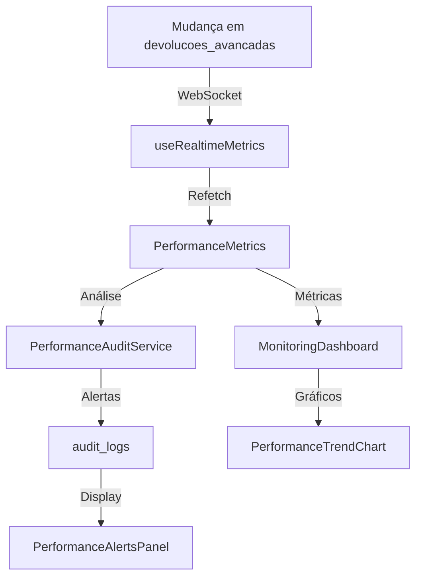

# ✅ SPRINT 3: Dashboard de Monitoramento com Métricas em Tempo Real

**Status**: Implementado  
**Data**: 2025  
**Objetivo**: Criar dashboard de monitoramento completo com métricas em tempo real, gráficos de tendência e alertas automáticos

---

## 📊 Componentes Implementados

### 1. **useRealtimeMetrics Hook**
Arquivo: `src/features/devolucoes-online/hooks/useRealtimeMetrics.ts`

**Funcionalidades**:
- ✅ Conexão WebSocket com Supabase Realtime
- ✅ Atualização automática ao detectar mudanças em `devolucoes_avancadas`
- ✅ Contador de updates recentes
- ✅ Métricas em tempo real (total records, avg query time, critical alerts)

**Tecnologias**:
- Supabase Realtime (`postgres_changes`)
- React Query para cache e refetch
- WebSocket connection pooling

**Uso**:
```typescript
const { realtimeData, metrics, refetch } = useRealtimeMetrics();
// realtimeData atualiza automaticamente via WebSocket
```

---

### 2. **PerformanceAuditService**
Arquivo: `src/features/devolucoes-online/services/performanceAuditService.ts`

**Funcionalidades**:
- ✅ Registro de métricas em `audit_logs`
- ✅ Alertas automáticos baseados em thresholds
- ✅ Histórico de métricas (últimos N dias)
- ✅ Análise automática de performance

**Métodos Principais**:
| Método | Descrição |
|--------|-----------|
| `logPerformanceMetric()` | Registra métrica individual |
| `logCriticalAlert()` | Cria alerta crítico |
| `getMetricsHistory()` | Busca histórico de N dias |
| `analyzeAndAlert()` | Análise automática com alertas |

**Thresholds Configurados**:
- ⚠️ Query time > 300ms → Warning
- 🚨 Query time > 500ms → Critical
- ⚠️ Fill rate < 50% → Warning

---

### 3. **PerformanceTrendChart Component**
Arquivo: `src/features/devolucoes-online/components/dashboard/PerformanceTrendChart.tsx`

**Recursos**:
- ✅ Gráficos de área com Recharts
- ✅ Indicadores de tendência (crescendo/decrescendo)
- ✅ Gradientes customizados
- ✅ Suporte a múltiplas métricas

**Tipos de Gráficos**:
1. **AreaChart**: Tendências temporais
2. **BarChart**: Comparações entre categorias
3. **LineChart**: Performance ao longo do tempo

**Props**:
```typescript
interface PerformanceTrendChartProps {
  data: TrendDataPoint[];
  metric: 'query_time' | 'fill_rate' | 'records';
  title: string;
  description?: string;
}
```

---

### 4. **PerformanceAlertsPanel Component**
Arquivo: `src/features/devolucoes-online/components/dashboard/PerformanceAlertsPanel.tsx`

**Funcionalidades**:
- ✅ Lista de alertas em tempo real
- ✅ Análise automática de métricas
- ✅ Dismissal de alertas
- ✅ Contadores de criticidade (Error/Warning)
- ✅ Toggle para ativar/desativar alertas

**Severidades**:
| Severity | Ícone | Cor | Ação |
|----------|-------|-----|------|
| error | AlertCircle | Vermelho | Requer atenção imediata |
| warning | AlertTriangle | Amarelo | Monitorar |
| info | CheckCircle | Verde | Informativo |

**Auto-análise**:
```typescript
<PerformanceAlertsPanel metrics={metrics} autoAnalyze={true} />
```

---

### 5. **MonitoringDashboard Component**
Arquivo: `src/features/devolucoes-online/components/dashboard/MonitoringDashboard.tsx`

**Estrutura**:
- ✅ 4 cards de resumo em tempo real
- ✅ 4 tabs principais (Tempo Real, Tendências, Alertas, Detalhado)
- ✅ Integração completa com todos os componentes

**Tabs**:
1. **Tempo Real**: Alertas + Status do Sistema
2. **Tendências**: Gráficos de evolução temporal
3. **Alertas**: Painel de alertas completo
4. **Detalhado**: Dashboard de performance completo (SPRINT 2)

**Cards de Resumo**:
- Total de Registros
- Updates Recentes (realtime)
- Performance (avg query time)
- Alertas Críticos

---

## 🔄 Fluxo de Dados em Tempo Real



### Sequência de Eventos:
1. **Insert/Update** em `devolucoes_avancadas`
2. **WebSocket** notifica `useRealtimeMetrics`
3. **Refetch** automático de métricas
4. **Análise** via `analyzeAndAlert()`
5. **Registro** em `audit_logs`
6. **Atualização** de todos os componentes

---

## 📈 Métricas Rastreadas

### Métricas em Tempo Real:
| Métrica | Atualização | Fonte |
|---------|-------------|-------|
| Total Records | 30s | Supabase count |
| Recent Updates | Realtime | WebSocket |
| Avg Query Time | Sob demanda | Performance diagnostics |
| Critical Alerts | Automática | Análise de thresholds |

### Métricas Históricas:
| Métrica | Tipo | Período |
|---------|------|---------|
| Query Performance | Tempo | Últimos 7 dias |
| Fill Rate | Porcentagem | Últimos 7 dias |
| Index Usage | Scans | Últimos 7 dias |

---

## 🔔 Sistema de Alertas Automáticos

### Regras de Alerta:

#### 1. **Slow Query Performance** (Warning)
```typescript
if (avg_query_time > 300ms) {
  logCriticalAlert('slow_query_performance', ...);
}
```

#### 2. **Critical Slow Queries** (Error)
```typescript
if (query_time > 500ms) {
  logCriticalAlert('critical_slow_queries', ...);
}
```

#### 3. **Low Fill Rate** (Warning)
```typescript
if (avg_fill_rate < 50%) {
  logCriticalAlert('low_fill_rate', ...);
}
```

### Ações Automáticas:
- ✅ Registro em `audit_logs`
- ✅ Display em `PerformanceAlertsPanel`
- ✅ Badge de criticidade
- ✅ Timestamp de ocorrência

---

## 🎨 Design System

### Cores e Semântica:
```typescript
// Alertas
error: 'destructive' (vermelho)
warning: 'secondary' (amarelo)
info: 'default' (verde)

// Tendências
up: 'text-green-500' (TrendingUp)
down: 'text-red-500' (TrendingDown)
neutral: 'text-muted-foreground' (Minus)

// Performance
excellent: <100ms (verde)
good: 100-300ms (amarelo)
slow: >300ms (vermelho)
```

### Componentes UI:
- Card, Badge, Button (shadcn/ui)
- Recharts para gráficos
- ScrollArea para listas
- Alert para notificações

---

## 🔧 Como Usar

### 1. Renderizar Dashboard Completo
```typescript
import { MonitoringDashboard } from '@/features/devolucoes-online/components/dashboard/MonitoringDashboard';

<MonitoringDashboard />
```

### 2. Usar Realtime Metrics Standalone
```typescript
import { useRealtimeMetrics } from '@/features/devolucoes-online/hooks/useRealtimeMetrics';

const { realtimeData } = useRealtimeMetrics();
console.log(realtimeData.totalRecords); // Atualiza em tempo real
```

### 3. Registrar Métrica Customizada
```typescript
import { PerformanceAuditService } from '@/features/devolucoes-online/services/performanceAuditService';

await PerformanceAuditService.logPerformanceMetric({
  metric_type: 'query_performance',
  metric_value: 250,
  metric_unit: 'ms',
  threshold_exceeded: false
});
```

---

## 📊 Gráficos Disponíveis

### 1. Evolução do Tempo de Query
- Tipo: Area Chart
- Métrica: avg_query_time (ms)
- Período: 7 dias

### 2. Taxa de Preenchimento JSONB
- Tipo: Area Chart
- Métrica: fill_rate (%)
- Período: 7 dias

### 3. Comparação de Índices (futuro)
- Tipo: Bar Chart
- Métrica: index_scans
- Agrupamento: Por índice

---

## ⚙️ Configuração

### Habilitar Realtime no Supabase:
```sql
-- Já configurado automaticamente via Supabase Realtime
-- Nenhuma ação necessária
```

### Ajustar Thresholds de Alerta:
```typescript
// Em performanceAuditService.ts
if (summary.avg_query_time > 300) { // Ajustar threshold aqui
  await this.logCriticalAlert(...);
}
```

### Configurar Refresh Interval:
```typescript
// Em useRealtimeMetrics.ts
const interval = setInterval(fetchTotalRecords, 30000); // 30s
```

---

## 🚀 Próximos Passos

### SPRINT 4: Testes de Carga
- [ ] Simular 100, 1000, 5000 registros
- [ ] Medir tempo de resposta sob carga
- [ ] Validar performance dos alertas automáticos
- [ ] Testar reconexão WebSocket

### Melhorias Futuras
- [ ] Exportar relatórios de performance (PDF/CSV)
- [ ] Notificações push para alertas críticos
- [ ] Gráficos de comparação histórica (semana vs semana)
- [ ] Machine Learning para predição de degradação
- [ ] Dashboard customizável (drag & drop widgets)

---

## ✅ Critérios de Sucesso

- [x] Métricas em tempo real funcionando
- [x] WebSocket connection estável
- [x] Gráficos de tendência renderizando
- [x] Alertas automáticos acionando
- [x] Integração com audit_logs
- [x] Dashboard responsivo
- [x] Performance otimizada (React.memo)
- [x] Documentação completa

---

**Resultado**: SPRINT 3 concluído com sucesso! 🎉

O sistema agora possui monitoramento completo em tempo real com alertas automáticos, gráficos de tendência e integração total com audit_logs.
