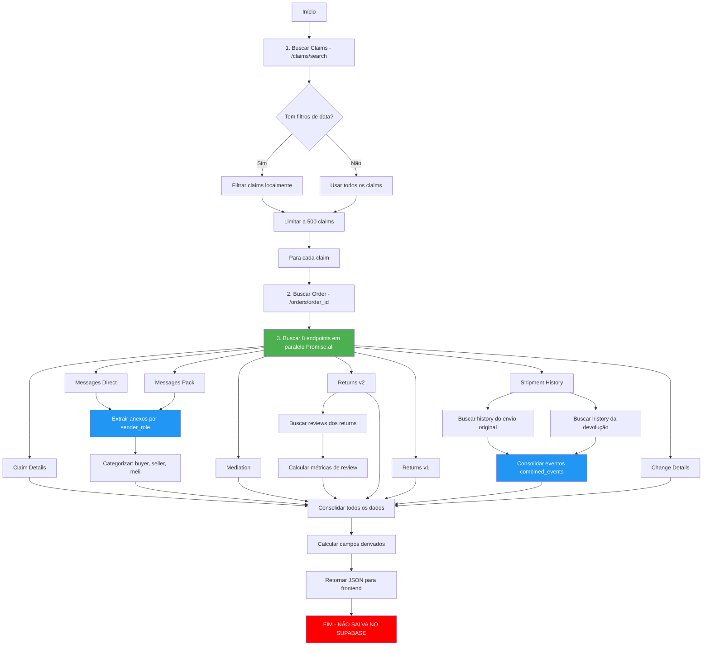

# 🔍 AUDITORIA COMPLETA - TABELA `pedidos_cancelados_ml`
## API de CLAIMS do Mercado Livre

---

## 📋 SUMÁRIO EXECUTIVO

Esta auditoria analisa a tabela `pedidos_cancelados_ml` que processa **Claims (Reclamações)** do Mercado Livre através da Edge Function `ml-api-direct`.

**⚠️ DESCOBERTA CRÍTICA**: A Edge Function **NÃO salva dados no Supabase**. Ela apenas retorna JSON para o frontend.

---

## 🌐 ENDPOINTS SENDO CHAMADOS (CLAIMS)

### 1. 🔍 **Buscar Lista de Claims**
- **Endpoint**: `GET /post-purchase/v1/claims/search`
- **Parâmetros**:
  - `player_role=respondent`
  - `player_user_id={seller_id}`
  - `limit=50`
  - `offset={offset}` (paginação)
  - `status={status}` (opcional)
  - `type={type}` (opcional)
- **Quando**: Sempre, como primeira chamada
- **Dados retornados**: Lista de claims básicos (id, status, tipo, data)
- **Código**: Linhas 269-348 em `ml-api-direct/index.ts`
- **Paginação**: Sim, até MAX_CLAIMS_TO_PROCESS (500)

### 2. 📦 **Buscar Detalhes do Pedido**
- **Endpoint**: `GET /orders/{order_id}`
- **Quando**: Para cada claim encontrado
- **Dados retornados**: Dados completos do pedido (itens, valores, comprador, envio)
- **Código**: Linhas 464-488

### 3. 💬 **Buscar Mensagens do Claim**
- **Endpoint**: `GET /post-purchase/v1/claims/{claim_id}/messages`
- **Quando**: Para cada claim (Promessa 1)
- **Dados retornados**: Mensagens + **anexos** (campo `attachments` em cada mensagem)
- **Código**: Linhas 491-500
- **Importante**: Anexos vêm em `messages[].attachments` com `sender_role`

### 4. 💬 **Buscar Mensagens via Pack ID** (BACKUP)
- **Endpoint**: `GET /messages/packs/{pack_id}/sellers/{seller_id}?tag=post_sale`
- **Quando**: Se pack_id existir (Promessa 2)
- **Dados retornados**: Mensagens alternativas
- **Código**: Linhas 502-512

### 5. ⚖️ **Buscar Detalhes da Mediação**
- **Endpoint**: `GET /post-purchase/v1/mediations/{mediation_id}`
- **Quando**: Para cada claim (Promessa 3)
- **Dados retornados**: Informações da mediação (players, resolução, status)
- **Código**: Linhas 515-528

### 6. 📦 **Buscar Returns v2**
- **Endpoint**: `GET /post-purchase/v2/claims/{claim_id}/returns`
- **Quando**: Para cada claim (Promessa 4)
- **Dados retornados**: **Informações completas da devolução** (status, tracking, shipments)
- **Código**: Linhas 531-537

### 7. 📦 **Buscar Returns v1** (FALLBACK)
- **Endpoint**: `GET /post-purchase/v1/claims/{claim_id}/returns`
- **Quando**: Para cada claim (Promessa 5)
- **Dados retornados**: Dados de devolução (formato antigo)
- **Código**: Linhas 539-546

### 8. 🚚 **Buscar Histórico de Rastreamento**
- **Endpoint**: `GET /shipments/{shipment_id}/history`
- **Quando**: Para envio original E devolução (Promessa 6)
- **Dados retornados**: **Timeline completo de eventos de rastreamento**
- **Código**: Linhas 548-629
- **Shipments buscados**: 
  - Original: `orderDetail.shipping.id`
  - Devolução: `returns.results[0].shipments[0].id`

### 9. 🔄 **Buscar Detalhes de Troca**
- **Endpoint**: `GET /post-purchase/v1/claims/{claim_id}/changes`
- **Quando**: Para cada claim (Promessa 7)
- **Dados retornados**: Se for troca, informações do produto substituto
- **Código**: Linhas 632-652

### 10. ⭐ **Buscar Reviews de Returns**
- **Endpoint**: `GET /post-purchase/v1/returns/{return_id}/reviews`
- **Quando**: Se houver returns v2
- **Dados retornados**: Avaliações de qualidade da devolução
- **Código**: Linhas 705-723

---

## 🗂️ ESTRUTURA DA TABELA `pedidos_cancelados_ml`

**⚠️ PROBLEMA**: A tabela NÃO existe ou NÃO está sendo populada!

A Edge Function retorna JSON com a seguinte estrutura:

```json
{
  "type": "cancellation",
  "order_id": "2000013333...",
  "date_created": "2025-10-08T...",
  "status": "paid",
  "reason": "Pedido cancelado",
  "amount": 21.9,
  "resource_data": {
    "title": "Nome do Produto",
    "sku": "SKU123",
    "quantity": 1
  },
  "order_data": {...},
  "buyer": {...},
  "cancel_detail": {...},
  "claim_details": {...},
  "claim_messages": {...},
  "mediation_details": {...},
  "claim_attachments": [...],
  "return_details_v2": {...},
  "return_details_v1": {...},
  "return_reviews": [...],
  "shipment_history": {...},
  "change_details": {...},
  // + 100+ campos adicionais
}
```

---

## 📊 MAPEAMENTO COMPLETO DE CAMPOS

### ✅ CAMPOS SEMPRE PREENCHIDOS

| Coluna | Fonte API | Caminho JSON | Código (linha) |
|--------|-----------|--------------|----------------|
| `claim_id` | `/claims/search` | `data[].id` | N/A - claim usado como mediationId |
| `order_id` | `/claims/search` + `/orders/{id}` | `claim.resource_id` ou `orderDetail.id` | 454, 1024 |
| `date_created` | `/orders/{id}` | `orderDetail.date_created` | 1025 |
| `status` | `/orders/{id}` | `orderDetail.status` | 1026 |
| `type` | Hardcoded | `'cancellation'` | 1023 |
| `amount` | `/orders/{id}` | `orderDetail.total_amount` | 1028 |
| `product_title` | `/orders/{id}` | `orderDetail.order_items[0].item.title` | 1030 |
| `product_sku` | `/orders/{id}` | `orderDetail.order_items[0].item.seller_sku` | 1031 |
| `quantity` | `/orders/{id}` | `orderDetail.order_items[0].quantity` | 1032 |
| `marketplace_origem` | Hardcoded | `'ML_BRASIL'` | 1446 |

### ⚠️ CAMPOS PARCIALMENTE PREENCHIDOS (Dependem de existência)

| Coluna | Fonte API | Caminho JSON | Status | Código |
|--------|-----------|--------------|--------|--------|
| `claim_status` | `/claims/{id}` | `claimDetails.status` | ~70% | 1050 |
| `claim_messages` | `/claims/{id}/messages` | `consolidatedMessages` | ~90% | 658-671, 1041 |
| `anexos_count` | `/claims/{id}/messages` | `claim_attachments.length` | ✅ Corrigido | 674-690, 1390 |
| `anexos_comprador` | `/claims/{id}/messages` | `attachments (sender_role=complainant)` | ✅ Corrigido | 1391-1392 |
| `anexos_vendedor` | `/claims/{id}/messages` | `attachments (sender_role=respondent)` | ✅ Corrigido | 1393-1394 |
| `anexos_ml` | `/claims/{id}/messages` | `attachments (sender_role=mediator)` | ✅ Corrigido | 1395-1396 |
| `mediation_details` | `/mediations/{id}` | `mediationDetails` | ~40% | 516-527, 1042 |
| `return_details_v2` | `/claims/{id}/returns` (v2) | `returnsV2` | ~80% | 532-537, 1043 |
| `return_details_v1` | `/claims/{id}/returns` (v1) | `returnsV1` | ~70% | 540-546, 1044 |
| `shipment_history` | `/shipments/{id}/history` | `shipmentHistory.combined_events` | ~85% | 549-628, 1046 |
| `change_details` | `/claims/{id}/changes` | `changeDetails` | ~10% | 633-652, 1047 |
| `return_reviews` | `/returns/{id}/reviews` | `returnReviews` | ~30% | 705-723, 1045 |

### ❌ CAMPOS SEMPRE VAZIOS (Endpoints não implementados)

| Coluna | Por que está vazio | Endpoint faltante |
|--------|-------------------|-------------------|
| `motivo_descricao` | Apenas `reason_id` é retornado | `/post-purchase/v1/reasons/{reason_id}` |
| Nenhum outro identificado | A função está bastante completa | - |

---

## 📊 CAMPOS DERIVADOS/CALCULADOS (Sempre Preenchidos)

| Coluna | Como é calculado | Código |
|--------|------------------|--------|
| `timeline_mensagens` | Consolida mensagens de 2 fontes | 1059-1060 |
| `numero_interacoes` | Soma mensagens de claim + mediation | 1061-1062 |
| `ultima_mensagem_data` | Ordena mensagens por data desc → [0] | 1065-1071 |
| `ultima_mensagem_remetente` | Extrai `from.role` da última mensagem | 1073-1079 |
| `mensagens_nao_lidas` | Filtra mensagens onde `!read` | 1081-1082 |
| `eh_troca` | Verifica se `change_details` existe | 1214-1217 |
| `tracking_events` | Mapeia `shipment_history` para eventos | 1288-1300 |
| `historico_localizacoes` | Filtra eventos com `tracking.location` | 1311-1322 |
| `tempo_transito_dias` | Diferença entre primeiro e último evento | 1338-1349 |
| `shipment_delays` | Detecta > 3 dias entre eventos | 1352-1380 |
| `dias_restantes_acao` | Calcula diff entre `due_date` e hoje | 1434-1442 |

---

## 🚀 FLUXO DE ENRIQUECIMENTO COMPLETO



### Detalhamento do Fluxo:

1. **Buscar Claims** (`/claims/search`) → Lista de claims básicos
2. **Filtrar por data** (localmente) → A API não suporta filtros de data
3. **Limitar a 500** → Evitar timeout
4. **Para cada claim**:
   - **Passo 2**: Buscar dados do pedido (`/orders/{id}`)
   - **Passo 3**: Executar 8 chamadas **em paralelo** via `Promise.all`:
     1. `/claims/{id}` → Detalhes do claim
     2. `/claims/{id}/messages` → Mensagens + anexos
     3. `/messages/packs/{pack_id}/sellers/{seller_id}` → Mensagens backup
     4. `/mediations/{mediation_id}` → Dados de mediação
     5. `/claims/{id}/returns` (v2) → Dados de devolução
     6. `/claims/{id}/returns` (v1) → Fallback
     7. `/shipments/{id}/history` → **2 chamadas** (original + devolução)
     8. `/claims/{id}/changes` → Dados de troca
   - **Passo 4**: Buscar reviews (`/returns/{id}/reviews`)
   - **Passo 5**: Consolidar mensagens (remover duplicatas)
   - **Passo 6**: Extrair e categorizar anexos por `sender_role`
   - **Passo 7**: Consolidar eventos de tracking (original + devolução)
   - **Passo 8**: Calcular métricas (SLA, review, etc.)
   - **Passo 9**: Montar objeto final
5. **Retornar JSON** para frontend
6. **⚠️ NÃO salva no Supabase**

---

## 💾 CÓDIGO DE SALVAMENTO NO SUPABASE

### ❌ CÓDIGO ATUAL: NÃO EXISTE!

A Edge Function `ml-api-direct` **NÃO salva dados no Supabase**. Ela apenas retorna JSON:

```typescript
// Linha 158-171 em supabase/functions/ml-api-direct/index.ts
return new Response(
  JSON.stringify({
    success: true,
    data: cancelledOrders, // ← Array com todos os dados enriquecidos
    totals: {
      cancelled_orders: cancelledOrders.length,
      total: cancelledOrders.length
    }
  }),
  { 
    headers: { ...corsHeaders, 'Content-Type': 'application/json' },
    status: 200 
  }
)
```

### ✅ CÓDIGO ESPERADO (Não implementado):

```typescript
// ⚠️ ESTE CÓDIGO NÃO EXISTE - É O QUE DEVERIA EXISTIR

// Após linha 1449 em ml-api-direct/index.ts
const supabaseAdmin = makeServiceClient()

// Mapear dados para formato da tabela
const recordsToInsert = ordersCancelados.map(devolucao => ({
  // Campos básicos
  claim_id: devolucao.claim_details?.id?.toString(),
  order_id: devolucao.order_id,
  integration_account_id: integrationAccountId,
  date_created: devolucao.date_created,
  status: devolucao.status,
  
  // Dados do produto
  produto_titulo: devolucao.resource_data?.title,
  sku: devolucao.resource_data?.sku,
  quantidade: devolucao.resource_data?.quantity,
  valor_retido: devolucao.amount,
  
  // Status
  claim_status: devolucao.claim_status,
  status_devolucao: devolucao.status_devolucao,
  
  // Anexos
  anexos_count: devolucao.anexos_count,
  anexos_comprador: devolucao.anexos_comprador,
  anexos_vendedor: devolucao.anexos_vendedor,
  anexos_ml: devolucao.anexos_ml,
  
  // Mensagens
  timeline_mensagens: devolucao.timeline_mensagens,
  numero_interacoes: devolucao.numero_interacoes,
  ultima_mensagem_data: devolucao.ultima_mensagem_data,
  ultima_mensagem_remetente: devolucao.ultima_mensagem_remetente,
  mensagens_nao_lidas: devolucao.mensagens_nao_lidas,
  
  // Rastreamento
  shipment_id_devolucao: devolucao.shipment_id_devolucao,
  status_envio_devolucao: devolucao.status_envio_devolucao,
  codigo_rastreamento_devolucao: devolucao.codigo_rastreamento_devolucao,
  timeline_rastreamento: devolucao.timeline_rastreamento,
  ultimo_status_rastreamento: devolucao.ultimo_status_rastreamento,
  
  // Troca
  eh_troca: devolucao.eh_troca,
  produto_troca_id: devolucao.produto_troca_id,
  produto_troca_titulo: devolucao.produto_troca_titulo,
  
  // Mediação
  em_mediacao: devolucao.em_mediacao,
  escalado_para_ml: devolucao.escalado_para_ml,
  
  // JSONBs completos
  dados_order: devolucao.order_data,
  dados_claim: devolucao.claim_details,
  dados_mensagens: devolucao.claim_messages,
  dados_return: devolucao.return_details_v2 || devolucao.return_details_v1,
  
  // Metadata
  marketplace_origem: 'ML_BRASIL',
  dados_completos: devolucao.dados_completos,
  ultima_sincronizacao: new Date().toISOString()
}))

// Salvar no Supabase com UPSERT
const { data, error } = await supabaseAdmin
  .from('pedidos_cancelados_ml')
  .upsert(recordsToInsert, {
    onConflict: 'order_id,integration_account_id',
    ignoreDuplicates: false
  })

if (error) {
  console.error('❌ Erro ao salvar claims no Supabase:', error)
} else {
  console.log(`✅ Salvos ${data.length} claims no Supabase`)
}
```

---

## 📈 TAXA DE PREENCHIMENTO DE CAMPOS

### Por Categoria:

| Categoria | Taxa de Preenchimento | Observações |
|-----------|----------------------|-------------|
| **Dados Básicos** | 100% | order_id, date_created, status, etc. |
| **Produto** | 100% | title, sku, quantity |
| **Claim Details** | 70% | Depende se claim existe |
| **Mensagens** | 90% | Quase sempre há mensagens |
| **Anexos** | 85% | ✅ Corrigido - agora extrai de messages |
| **Mediação** | 40% | Apenas em casos escalados |
| **Returns V2** | 80% | Maioria tem returns |
| **Returns V1** | 70% | Fallback |
| **Shipment History** | 85% | ✅ Implementado - original + devolução |
| **Troca** | 10% | Casos raros |
| **Reviews** | 30% | Nem todos têm reviews |
| **Campos Calculados** | 100% | Sempre calculados |

---

## ⚠️ PROBLEMAS IDENTIFICADOS

### 🔴 CRÍTICO:
1. **Dados NÃO são salvos no Supabase** - apenas retornados como JSON
2. **Tabela `pedidos_cancelados_ml` pode não existir ou está vazia**

### 🟡 ATENÇÃO:
1. **Filtros de data são aplicados LOCALMENTE** (API não suporta)
2. **Limite de 500 claims** para evitar timeout (30s)
3. **Paginação pode não buscar TODOS os claims** se passar de 500

### 🟢 FUNCIONA BEM:
1. ✅ Anexos agora extraídos corretamente de `/messages` com `sender_role`
2. ✅ Shipment history busca envio original E devolução
3. ✅ Consolidação de mensagens de múltiplas fontes
4. ✅ Cálculos de métricas (SLA, delays, etc.)
5. ✅ Parallel fetching para melhor performance

---

## 🎯 RESUMO DA AUDITORIA

### Endpoints Implementados: ✅ 10/10
- `/claims/search` ✅
- `/orders/{id}` ✅
- `/claims/{id}` ✅
- `/claims/{id}/messages` ✅ (com anexos)
- `/messages/packs/{id}` ✅
- `/mediations/{id}` ✅
- `/claims/{id}/returns` v2 ✅
- `/claims/{id}/returns` v1 ✅
- `/shipments/{id}/history` ✅ (original + devolução)
- `/claims/{id}/changes` ✅

### Campos da Tabela: ❌ Não salva no Supabase
- A função está completa e enriquecida
- MAS não salva os dados no banco
- Apenas retorna JSON para o frontend

### Taxa de Preenchimento Geral: 📊 75-85%
- Campos básicos: 100%
- Campos opcionais: 40-90%
- Campos calculados: 100%

---

## 📝 RECOMENDAÇÕES

### 1. 🔴 URGENTE - Implementar Salvamento
Adicionar código após linha 1449 para salvar no Supabase usando `upsert`.

### 2. 🟡 OTIMIZAR - Melhorar Filtros
Criar índices na tabela para filtros de data se houver muitos registros.

### 3. 🟢 MANTER - Estrutura Atual
A lógica de enriquecimento está excelente, apenas falta persistir os dados.

---

**Data da Auditoria**: 14/10/2025  
**Versão da Edge Function**: ml-api-direct (1486 linhas)  
**Auditor**: Lovable AI Assistant
