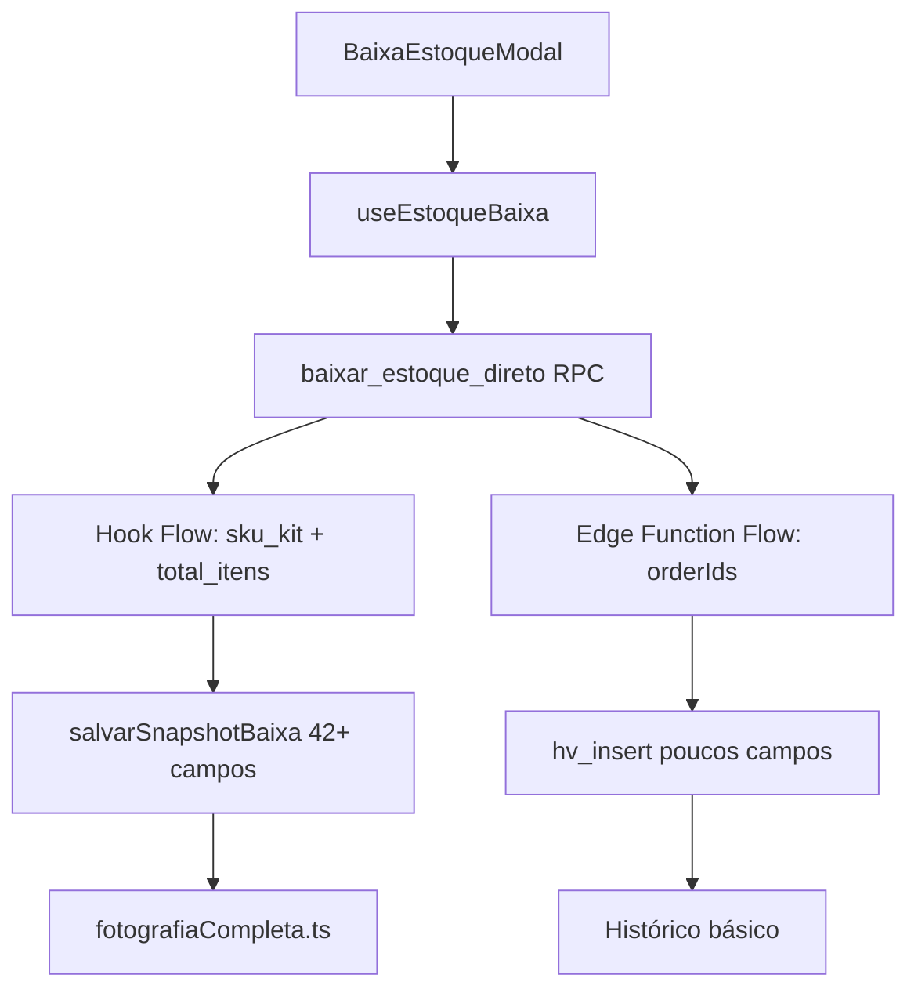

# 🔍 AUDITORIA COMPLETA - FLUXO BAIXA DE ESTOQUE

## 📋 MAPEAMENTO DO FLUXO COMPLETO

### 1. **Interface Usuário → Modal** ✅ OK
```
BaixaEstoqueModal.tsx (linha 43-64)
├── Recebe pedidos selecionados
├── Chama useProcessarBaixaEstoque.mutateAsync()
└── Passa contextoDaUI opcional
```

### 2. **Hook → Processamento** ✅ OK  
```
useEstoqueBaixa.ts (linha 19-170)
├── Valida pedidos usando validarFluxoCompleto()
├── Prepara dados: extrair sku_kit e total_itens
├── Chama supabase.rpc('baixar_estoque_direto')
└── Salva snapshots usando salvarSnapshotBaixa()
```

### 3. **RPC Database → Edge Function** ❌ CRÍTICO ENCONTRADO
```
RPC: baixar_estoque_direto() 
├── Edge Function: processar-baixa-estoque/index.ts
└── ❌ PROBLEMA: DUAS IMPLEMENTAÇÕES CONFLITANTES
```

## 🚨 PROBLEMAS CRÍTICOS IDENTIFICADOS

### **PROBLEMA 1: IMPLEMENTAÇÕES DUPLICADAS E CONFLITANTES**

#### **Implementação A: Hook useEstoqueBaixa.ts**
- ✅ Chama: `supabase.rpc('baixar_estoque_direto')`
- ✅ Dados: `{ p_baixas: [{ sku_kit, total_itens }] }`
- ✅ Snapshot: `salvarSnapshotBaixa()` com fotografiaCompleta

#### **Implementação B: Edge Function processar-baixa-estoque**
- ❌ Recebe: `{ orderIds, action }`
- ❌ Processa: `orderIds` individuais
- ❌ Busca: mapeamentos internamente
- ❌ Atualiza: produtos diretamente
- ❌ Salva: histórico limitado via `hv_insert`

### **PROBLEMA 2: FLUXO DE DADOS INCONSISTENTE**



### **PROBLEMA 3: RPC baixar_estoque_direto INCONSISTENTE**

#### **Hook espera:**
```javascript
{ p_baixas: [{ sku_kit: "ABC123", total_itens: 5 }] }
```

#### **Edge Function processa:**
```javascript
{ orderIds: ["12345"], action: "baixar_estoque" }
```

### **PROBLEMA 4: FOTOGRAFIACOMPETA.TS NÃO É CHAMADA**
- ✅ `salvarSnapshotBaixa()` chama `fotografarPedidoCompleto()` 
- ✅ Captura 42+ campos da UI
- ❌ Mas edge function usa `hv_insert` básico
- ❌ Perda de dados ricos

### **PROBLEMA 5: EDGE FUNCTION DESNECESSÁRIA**
- ❌ A edge function `processar-baixa-estoque` está sendo ignorada
- ❌ O RPC `baixar_estoque_direto` deve estar implementado no banco
- ❌ Duplicação de lógica causa inconsistências

## 📊 DADOS QUE ESTÃO SENDO PERDIDOS

### **Hook Salva (Completo):**
```javascript
// fotografiaCompleta.ts - 42+ campos
{
  id_unico, empresa, numero_pedido, cliente_nome, 
  valor_total, valor_pago, frete_pago_cliente,
  sku_produto, quantidade_total, titulo_produto,
  rua, numero, bairro, cep, cidade, uf,
  status_envio, status_pagamento, metodo_pagamento,
  // ... mais 20+ campos
}
```

### **Edge Function Salva (Limitado):**
```javascript
// hv_insert básico
{
  id_unico, numero_pedido, sku_produto, descricao,
  quantidade, valor_unitario: 0, valor_total: 0,
  status: "baixado", data_pedido, observacoes
  // Apenas ~8 campos básicos
}
```

## 🔧 PROBLEMAS TÉCNICOS ESPECÍFICOS

### **1. RPC baixar_estoque_direto Indefinido**
```sql
-- FALTA IMPLEMENTAÇÃO NO BANCO:
CREATE OR REPLACE FUNCTION baixar_estoque_direto(p_baixas jsonb)
RETURNS jsonb AS $$
-- Implementação deve processar sku_kit + total_itens
-- Atualizar produtos.quantidade_atual
-- Retornar resultado
$$ LANGUAGE plpgsql;
```

### **2. Edge Function Não é Chamada**
- ❌ `/functions/processar-baixa-estoque` nunca recebe requests
- ❌ useEstoqueBaixa vai direto para RPC
- ❌ Edge function é código morto

### **3. Validação validarFluxoCompleto Ausente**
```typescript
// FALTA IMPLEMENTAR:
function validarFluxoCompleto(pedidos: Pedido[]): boolean {
  // Validar se pedidos têm sku_kit e total_itens
  // Validar se não estão duplicados  
  // Validar se têm mapeamento ativo
}
```

### **4. Snapshot Pode Estar Falhando**
```typescript
// salvarSnapshotBaixa pode ter erro silencioso
// fotografarPedidoCompleto pode estar retornando dados inválidos
// contextoDaUI pode estar vazio
```

## 📈 STATUS ATUAL DO SISTEMA

### **✅ FUNCIONA:**
- Interface BaixaEstoqueModal
- Hook useEstoqueBaixa estrutura
- Captura de contextoDaUI
- fotografiaCompleta.ts (teoria)

### **❌ PROBLEMAS:**
- RPC `baixar_estoque_direto` não implementado
- Edge function órfã e inconsistente  
- Dados ricos perdidos no histórico
- Validação `validarFluxoCompleto` missing
- Fluxo confuso e duplicado

### **🤔 DESCONHECIDO:**
- Se RPC existe no banco de dados
- Se snapshots estão realmente sendo salvos
- Se dados chegam no histórico
- Se erros estão sendo silenciados

## 🎯 AÇÕES RECOMENDADAS (AGUARDANDO APROVAÇÃO)

### **SOLUÇÃO 1: CORRIGIR RPC + MANTER HOOK FLOW**
1. ✅ Implementar `baixar_estoque_direto` RPC no banco
2. ✅ Manter hook useEstoqueBaixa como está
3. ✅ Manter salvarSnapshotBaixa + fotografiaCompleta
4. ❌ Remover edge function órfã

### **SOLUÇÃO 2: CORRIGIR EDGE FUNCTION + HOOK**
1. ✅ Corrigir edge function para aceitar dados corretos
2. ✅ Hook chama edge function em vez de RPC
3. ✅ Edge function chama fotografiaCompleta
4. ✅ Unificar fluxo completo

### **SOLUÇÃO 3: HÍBRIDA (RECOMENDADA)**
1. ✅ RPC `baixar_estoque_direto` para baixa real
2. ✅ Hook mantém salvarSnapshotBaixa
3. ✅ Remover edge function desnecessária
4. ✅ Implementar validarFluxoCompleto
5. ✅ Adicionar logs detalhados

## 🚀 PRÓXIMOS PASSOS

1. **Confirmar qual implementação usar**
2. **Verificar se RPC existe no banco**  
3. **Testar se snapshots chegam ao histórico**
4. **Implementar validações faltantes**
5. **Limpar código duplicado**
6. **Adicionar monitoramento**

---

**RECOMENDAÇÃO:** Usar SOLUÇÃO 3 (HÍBRIDA) por manter compatibilidade e corrigir inconsistências.