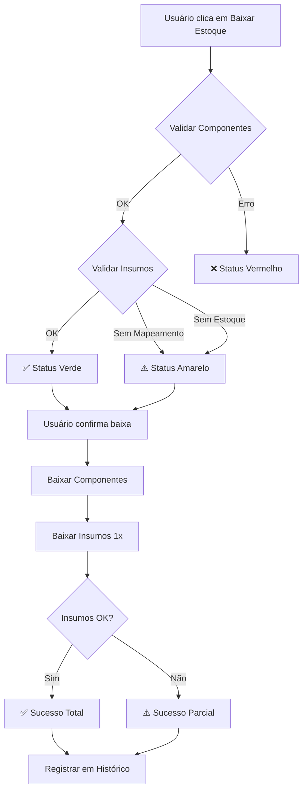

# 📋 Planejamento: Sistema de Composições de Insumos

## 🎯 Objetivo
Criar sistema para gerenciar insumos que são debitados **1 vez por pedido** (independente da quantidade), como etiquetas e embalagens, separado das composições de produtos que multiplicam por quantidade.

---

## 🗂️ 1. Estrutura de Banco de Dados

### 1.1 Nova Tabela: `composicoes_insumos`

```sql
CREATE TABLE public.composicoes_insumos (
  id UUID PRIMARY KEY DEFAULT gen_random_uuid(),
  organization_id UUID NOT NULL REFERENCES public.organizacoes(id) ON DELETE CASCADE,
  
  -- SKU do produto final
  sku_produto TEXT NOT NULL,
  
  -- SKU do insumo (deve existir em produtos)
  sku_insumo TEXT NOT NULL,
  
  -- Quantidade fixa (sempre 1 por pedido)
  quantidade INTEGER NOT NULL DEFAULT 1,
  
  -- Metadados
  observacoes TEXT,
  ativo BOOLEAN NOT NULL DEFAULT true,
  
  created_at TIMESTAMPTZ NOT NULL DEFAULT now(),
  updated_at TIMESTAMPTZ NOT NULL DEFAULT now(),
  
  -- Constraints
  CONSTRAINT composicoes_insumos_org_sku_insumo_unique 
    UNIQUE (organization_id, sku_produto, sku_insumo),
  
  CONSTRAINT composicoes_insumos_quantidade_positiva 
    CHECK (quantidade > 0)
);

-- Índices
CREATE INDEX idx_composicoes_insumos_org ON public.composicoes_insumos(organization_id);
CREATE INDEX idx_composicoes_insumos_sku_produto ON public.composicoes_insumos(sku_produto);
CREATE INDEX idx_composicoes_insumos_sku_insumo ON public.composicoes_insumos(sku_insumo);

-- RLS Policies
ALTER TABLE public.composicoes_insumos ENABLE ROW LEVEL SECURITY;

CREATE POLICY "Users can view insumos from their org"
  ON public.composicoes_insumos FOR SELECT
  USING (organization_id = public.get_current_org_id());

CREATE POLICY "Users can insert insumos in their org"
  ON public.composicoes_insumos FOR INSERT
  WITH CHECK (organization_id = public.get_current_org_id());

CREATE POLICY "Users can update insumos in their org"
  ON public.composicoes_insumos FOR UPDATE
  USING (organization_id = public.get_current_org_id());

CREATE POLICY "Users can delete insumos in their org"
  ON public.composicoes_insumos FOR DELETE
  USING (organization_id = public.get_current_org_id());

-- Trigger para updated_at
CREATE TRIGGER update_composicoes_insumos_updated_at
  BEFORE UPDATE ON public.composicoes_insumos
  FOR EACH ROW
  EXECUTE FUNCTION public.update_updated_at_column();
```

### 1.2 Função RPC: `baixar_insumos_pedido`

```sql
CREATE OR REPLACE FUNCTION public.baixar_insumos_pedido(p_insumos jsonb)
RETURNS json
LANGUAGE plpgsql
SECURITY DEFINER
SET search_path TO 'public'
AS $$
DECLARE
  v_org_id uuid;
  v_sku text;
  v_quantidade int;
  v_produto record;
  v_total_processados int := 0;
  v_total_sucesso int := 0;
  v_erros jsonb := '[]'::jsonb;
  v_insumo jsonb;
BEGIN
  v_org_id := public.get_current_org_id();
  
  IF v_org_id IS NULL THEN
    RETURN json_build_object('success', false, 'error', 'Organização não encontrada');
  END IF;

  -- Processar cada insumo (sempre quantidade = 1)
  FOR v_insumo IN SELECT * FROM jsonb_array_elements(p_insumos)
  LOOP
    v_sku := v_insumo->>'sku';
    v_quantidade := 1; -- SEMPRE 1 POR PEDIDO
    v_total_processados := v_total_processados + 1;
    
    IF v_sku IS NULL OR v_sku = '' THEN
      v_erros := v_erros || jsonb_build_object('sku', v_sku, 'erro', 'SKU não informado');
      CONTINUE;
    END IF;
    
    -- Buscar produto (insumo no estoque)
    SELECT * INTO v_produto 
    FROM public.produtos 
    WHERE sku_interno = v_sku 
      AND organization_id = v_org_id 
      AND ativo = true;
    
    IF NOT FOUND THEN
      v_erros := v_erros || jsonb_build_object(
        'sku', v_sku, 
        'erro', format('Insumo "%s" não cadastrado no estoque', v_sku)
      );
      CONTINUE;
    END IF;
    
    -- Verificar estoque
    IF v_produto.quantidade_atual < 1 THEN
      v_erros := v_erros || jsonb_build_object(
        'sku', v_sku, 
        'erro', format('Estoque insuficiente para insumo "%s". Disponível: %s', v_sku, v_produto.quantidade_atual)
      );
      CONTINUE;
    END IF;
    
    -- Baixar 1 unidade
    UPDATE public.produtos 
    SET quantidade_atual = quantidade_atual - 1,
        updated_at = now()
    WHERE id = v_produto.id;
    
    -- Registrar movimentação
    INSERT INTO public.movimentacoes_estoque (
      produto_id, 
      tipo_movimentacao, 
      quantidade_anterior, 
      quantidade_nova, 
      quantidade_movimentada,
      motivo,
      observacoes
    ) VALUES (
      v_produto.id,
      'saida',
      v_produto.quantidade_atual,
      v_produto.quantidade_atual - 1,
      1,
      'baixa_insumo_pedido',
      format('Baixa de insumo por pedido - SKU: %s', v_sku)
    );
    
    v_total_sucesso := v_total_sucesso + 1;
  END LOOP;
  
  RETURN json_build_object(
    'success', v_total_sucesso > 0,
    'total_processados', v_total_processados,
    'total_sucesso', v_total_sucesso,
    'total_erros', v_total_processados - v_total_sucesso,
    'erros', v_erros
  );
END;
$$;
```

---

## 📁 2. Estrutura de Arquivos

```
src/features/estoque/
├── components/
│   ├── EstoqueNav.tsx                    [MODIFICAR] - Adicionar tab "Insumos"
│   └── insumos/
│       ├── InsumosComposicoesTable.tsx   [CRIAR] - Tabela de composições de insumos
│       ├── InsumoForm.tsx                [CRIAR] - Formulário add/edit insumo
│       └── InsumoDeleteDialog.tsx        [CRIAR] - Confirmação de exclusão
│
├── hooks/
│   └── useInsumosComposicoes.ts          [CRIAR] - Hook para CRUD de insumos
│
├── services/
│   └── InsumosService.ts                 [CRIAR] - Serviço de validação e baixa
│
└── types/
    └── insumos.types.ts                  [CRIAR] - TypeScript types

src/pages/estoque/
└── InsumosPage.tsx                       [CRIAR] - Página principal de insumos

src/core/integracao/
└── FluxoValidacaoInsumos.ts              [CRIAR] - Validações de insumos para pedidos

src/components/pedidos/
└── BaixaEstoqueModal.tsx                 [MODIFICAR] - Integrar baixa de insumos
```

---

## 🔧 3. Componentes a Criar

### 3.1 `InsumosPage.tsx`
- **Localização**: `src/pages/estoque/InsumosPage.tsx`
- **Responsabilidade**: Página principal de gestão de insumos
- **Features**:
  - Listagem de composições de insumos
  - Filtros por SKU produto/insumo
  - Adicionar/Editar/Excluir insumos
  - Busca e paginação

### 3.2 `InsumosComposicoesTable.tsx`
- **Localização**: `src/features/estoque/components/insumos/InsumosComposicoesTable.tsx`
- **Responsabilidade**: Tabela de composições
- **Colunas**:
  - SKU Produto
  - Nome Produto
  - SKU Insumo
  - Nome Insumo
  - Quantidade (sempre 1)
  - Estoque Disponível
  - Ações (Editar/Excluir)

### 3.3 `InsumoForm.tsx`
- **Localização**: `src/features/estoque/components/insumos/InsumoForm.tsx`
- **Responsabilidade**: Formulário de cadastro/edição
- **Campos**:
  - Select: SKU Produto (busca em `produtos` ou `produtos_composicoes`)
  - Select: SKU Insumo (busca em `produtos`)
  - Input: Quantidade (padrão 1, desabilitado)
  - Textarea: Observações (opcional)

### 3.4 `useInsumosComposicoes.ts`
- **Localização**: `src/features/estoque/hooks/useInsumosComposicoes.ts`
- **Responsabilidade**: Hook para CRUD
- **Funcionalidades**:
  - `fetchInsumos()` - Listar todos os insumos
  - `getInsumosBySku(sku)` - Buscar insumos de um produto
  - `createInsumo()` - Criar novo insumo
  - `updateInsumo()` - Atualizar insumo
  - `deleteInsumo()` - Excluir insumo

### 3.5 `InsumosService.ts`
- **Localização**: `src/features/estoque/services/InsumosService.ts`
- **Responsabilidade**: Validações e baixa
- **Métodos**:
  - `validarInsumosParaPedido(pedido)` - Validar se há insumos cadastrados e estoque
  - `baixarInsumosPedido(pedido)` - Executar baixa (sempre 1 unidade)
  - `verificarEstoqueInsumos(sku)` - Verificar disponibilidade

---

## 🔄 4. Fluxo de Integração com Baixa de Estoque

### 4.1 Modificações em `BaixaEstoqueModal.tsx`

```typescript
// Adicionar validação de insumos junto com componentes
const validarPedidoCompleto = async (pedido) => {
  // 1. Validação de componentes (existente)
  const validacaoComponentes = await validarFluxoCompleto(pedido);
  
  // 2. Validação de insumos (NOVO)
  const validacaoInsumos = await InsumosService.validarInsumosParaPedido(pedido);
  
  return {
    componentes: validacaoComponentes,
    insumos: validacaoInsumos,
    statusGeral: determinarStatus(validacaoComponentes, validacaoInsumos)
  };
};
```

### 4.2 Estados do "Status da Baixa"

| Cor | Situação | Componentes | Insumos |
|-----|----------|-------------|---------|
| 🟢 Verde | Tudo OK | ✅ Mapeado + Estoque OK | ✅ Mapeado + Estoque OK |
| 🟡 Amarelo | Aviso | ✅ Mapeado + Estoque OK | ⚠️ Sem mapeamento OU sem estoque |
| 🟡 Amarelo | Aviso | ⚠️ Sem mapeamento | ✅ Mapeado + Estoque OK |
| 🔴 Vermelho | Erro | ❌ Sem mapeamento | ❌ Sem mapeamento |
| 🔴 Vermelho | Erro | ❌ Sem estoque | Qualquer |

### 4.3 Mensagens de Validação

```typescript
// Exemplo de mensagens
{
  verde: "✅ Estoque OK - Componentes e insumos disponíveis",
  amarelo: "⚠️ Insumos não mapeados - Apenas componentes serão baixados",
  vermelho: "❌ Componentes não mapeados - Impossível baixar estoque"
}
```

---

## 🎨 5. Interface do Usuário

### 5.1 Nova Tab em `/estoque`

**Navegação**:
```
[Controle] [Composições] [Insumos] [Histórico]
                           ↑ NOVA
```

### 5.2 Sidebar

**Adicionar em `EstoqueNav.tsx`**:
```tsx
<NavButton 
  to="/estoque/insumos"
  icon={Package}
  label="Insumos"
  description="1 por pedido"
/>
```

### 5.3 Layout da Página de Insumos

```
┌─────────────────────────────────────────────────────┐
│  📦 Composições de Insumos                          │
│  Insumos debitados 1x por pedido                    │
├─────────────────────────────────────────────────────┤
│  [🔍 Buscar SKU]  [+ Novo Insumo]                   │
├─────────────────────────────────────────────────────┤
│  SKU Produto | Nome | SKU Insumo | Estoque | Ações │
│  KIT-001     | Kit  | ETIQ-001   |   150   | ✏️ 🗑️  │
│  KIT-001     | Kit  | EMB-001    |    80   | ✏️ 🗑️  │
│  PROD-002    | Copo | ETIQ-001   |   150   | ✏️ 🗑️  │
└─────────────────────────────────────────────────────┘
```

---

## 🔐 6. Validações e Regras de Negócio

### 6.1 Validações no Cadastro
- ✅ SKU do produto deve existir em `produtos` ou `produtos_composicoes`
- ✅ SKU do insumo deve existir em `produtos` e estar ativo
- ✅ Não permitir duplicatas: mesmo produto + mesmo insumo
- ✅ Quantidade sempre = 1 (campo desabilitado no form)

### 6.2 Validações na Baixa de Estoque
- ✅ Verificar se insumo existe no estoque
- ✅ Verificar se há estoque disponível (>= 1)
- ⚠️ Se não houver mapeamento: aviso amarelo, mas permite baixar componentes
- ⚠️ Se não houver estoque: aviso amarelo, registra erro mas continua

### 6.3 Proteção contra Exclusão
- ❌ Não permitir exclusão de insumo em uso (verificar pedidos pendentes)
- ℹ️ Mostrar aviso se componente for usado em múltiplas composições

---

## 📊 7. Fluxo Completo da Baixa de Estoque



---

## 🚀 8. Plano de Implementação

### Fase 1: Database (30min)
1. Criar migration para tabela `composicoes_insumos`
2. Criar RPC `baixar_insumos_pedido`
3. Aplicar e testar migration

### Fase 2: Types & Services (20min)
4. Criar `insumos.types.ts`
5. Criar `InsumosService.ts`
6. Criar `useInsumosComposicoes.ts`

### Fase 3: UI Components (1h)
7. Criar `InsumosPage.tsx`
8. Criar `InsumosComposicoesTable.tsx`
9. Criar `InsumoForm.tsx`
10. Criar `InsumoDeleteDialog.tsx`

### Fase 4: Navegação (15min)
11. Modificar `EstoqueNav.tsx` - adicionar tab
12. Adicionar rota em `Estoque.tsx`

### Fase 5: Integração com Pedidos (45min)
13. Modificar `BaixaEstoqueModal.tsx`
14. Criar `FluxoValidacaoInsumos.ts`
15. Integrar validações no status da baixa

### Fase 6: Testes & Ajustes (30min)
16. Testar fluxo completo
17. Validar mensagens de erro
18. Ajustar UI/UX

**Tempo Total Estimado**: ~3 horas

---

## ✅ 9. Checklist de Validação

### Database
- [ ] Tabela criada com RLS habilitado
- [ ] RPC funcionando corretamente
- [ ] Índices criados
- [ ] Triggers de updated_at funcionando

### UI/UX
- [ ] Tab "Insumos" aparece no menu
- [ ] Tabela carrega corretamente
- [ ] Formulário valida campos
- [ ] Busca funciona
- [ ] Exclusão protegida

### Integração
- [ ] Status da baixa mostra validação de insumos
- [ ] Baixa de componentes continua funcionando
- [ ] Baixa de insumos executa (sempre 1x)
- [ ] Mensagens de erro claras
- [ ] Histórico registra corretamente

### Testes de Cenário
- [ ] Pedido com insumos mapeados + estoque OK → Verde
- [ ] Pedido sem insumos mapeados → Amarelo
- [ ] Pedido com insumos sem estoque → Amarelo
- [ ] Quantidade > 1 do mesmo produto → Insumo baixa 1x
- [ ] Múltiplos produtos no mesmo pedido → Insumo baixa 1x por SKU único

---

## 📝 10. Observações Importantes

### 🔑 Diferenças Críticas: Composições vs Insumos

| Característica | Composições de Produtos | Composições de Insumos |
|----------------|-------------------------|------------------------|
| **Multiplicador** | Quantidade do pedido | Sempre 1 (por pedido) |
| **Exemplo** | 3 produtos → 3x cada componente | 3 produtos → 1x cada insumo |
| **Uso** | Matéria-prima, peças | Etiqueta, embalagem |
| **Tabela** | `produto_componentes` | `composicoes_insumos` |
| **RPC** | `baixar_estoque_direto` | `baixar_insumos_pedido` |

### ⚠️ Regras de Negócio Especiais

1. **Agrupamento por SKU**: Se um pedido tem:
   - 2x KIT-001
   - 1x KIT-002
   - E ambos usam ETIQ-001
   
   **Baixa**: 2x ETIQ-001 (1 por SKU único no pedido)

2. **Validação Não Bloqueante**: 
   - Falta de insumo = AVISO (amarelo)
   - Falta de componente = ERRO (vermelho, bloqueia)

3. **Prioridade na Baixa**:
   - 1º Baixar componentes (crítico)
   - 2º Baixar insumos (importante mas não bloqueante)

---

## 🎯 11. Resultado Final Esperado

✅ Usuário cadastra insumos vinculados a produtos  
✅ Sistema valida insumos antes de baixar estoque  
✅ Baixa sempre 1 unidade de cada insumo por pedido  
✅ Status da baixa reflete situação de componentes E insumos  
✅ Interface intuitiva igual à de Composições  
✅ Histórico registra movimentações de insumos separadamente  

---

**Documento criado em**: 2025-10-30  
**Versão**: 1.0  
**Status**: Pronto para implementação
