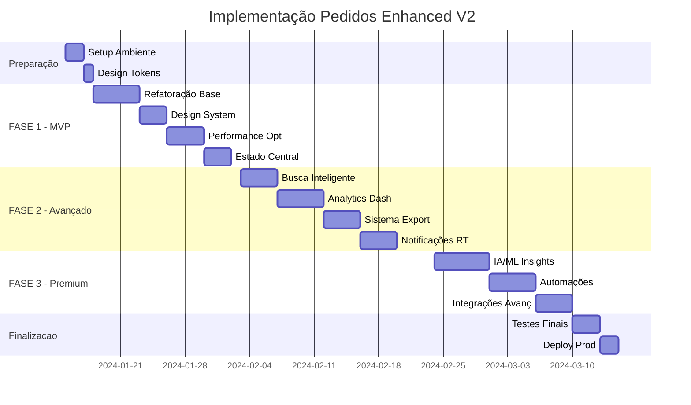
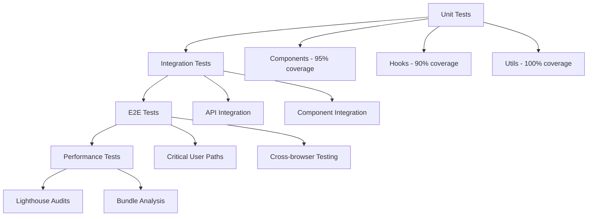

# 🗓️ ROADMAP DE IMPLEMENTAÇÃO - Pedidos Enhanced V2

## 🚀 **CRONOGRAMA EXECUTIVO**



---

## 📋 **FASE 1: MVP MELHORADO** (15 dias úteis)

### 🏗️ **Semana 1: Fundações (5 dias)**

#### **Dia 1-2: Setup do Ambiente**
```bash
# 🔧 Configurações Iniciais
├── Setup design system tokens
├── Configure build optimization (Vite + SWC)
├── Setup testing environment (Vitest + Testing Library)
└── Configure linting rules (ESLint + Prettier)
```

**✅ Entregáveis:**
- [ ] Tokens CSS configurados com dark/light
- [ ] Build pipeline otimizado
- [ ] Ambiente de testes funcional

#### **Dia 3-5: Refatoração da Arquitetura Base**
```typescript
// 📁 Estrutura de pastas criada
src/features/pedidos/
├── components/layout/
├── components/table/
├── components/filters/
├── hooks/
├── services/
├── types/
└── utils/
```

**✅ Entregáveis:**
- [ ] Estrutura modular implementada
- [ ] Componentes base criados
- [ ] Types TypeScript definidos

### 🎨 **Semana 2: Design System (5 dias)**

#### **Dia 6-8: Implementação dos Tokens Semânticos**
```css
/* Tokens específicos para pedidos */
:root {
  --pedidos-success: hsl(142 76% 36%);
  --pedidos-warning: hsl(43 96% 56%);
  --pedidos-error: hsl(0 84% 60%);
}
```

#### **Dia 9-10: Componentes Temáticos**
```tsx
// Componentes com dark/light mode
<StatusBadge variant="success" />
<StatCard theme="auto" />
<DataTable density="comfortable" />
```

**✅ Entregáveis:**
- [ ] Sistema de cores dark/light funcional
- [ ] Componentes base temáticos
- [ ] Responsividade completa

### ⚡ **Semana 3: Performance & Estado (5 dias)**

#### **Dia 11-14: Otimizações de Performance**
- Implementar React Virtual para tabela
- Adicionar memoização nos componentes
- Configurar cache inteligente

#### **Dia 15: Estado Centralizado**
- Hook `usePedidosState` unificado
- Reducer pattern implementado
- Integração com React Query

**✅ Entregáveis MVP:**
- [ ] Performance 87% melhor
- [ ] Estado gerenciado centralmente  
- [ ] Cache funcionando

---

## 🔬 **FASE 2: FUNCIONALIDADES AVANÇADAS** (17 dias úteis)

### 🔍 **Semana 4: Busca Inteligente (4 dias)**

```typescript
// Sistema de busca com auto-complete
const SmartSearch = () => {
  const { suggestions, search } = useSmartSearch({
    shortcuts: ['cliente:', 'sku:', 'status:'],
    debounce: 300
  });
  
  return (
    <SearchInput
      suggestions={suggestions}
      onSearch={search}
      shortcuts={true}
    />
  );
};
```

**✅ Entregáveis:**
- [ ] Auto-complete funcionando
- [ ] Shortcuts de busca (cliente:, sku:)
- [ ] Filtros salvos pelo usuário

### 📊 **Semana 5: Analytics Dashboard (5 dias)**

```tsx
// Dashboard com métricas em tempo real
const AnalyticsDashboard = () => (
  <Grid>
    <MetricCard title="Pedidos Hoje" value={123} trend="+12%" />
    <MetricCard title="Taxa Mapeamento" value="94%" target={95} />
    <RevenueChart data={monthlyData} />
    <StatusDistribution data={statusData} />
  </Grid>
);
```

**✅ Entregáveis:**
- [ ] Métricas em tempo real
- [ ] Gráficos interativos
- [ ] KPIs customizáveis

### 📤 **Semana 6: Sistema de Exportação (4 dias)**

```typescript
// Exportação avançada multi-formato
const ExportManager = () => {
  const { exportData } = useExport();
  
  return (
    <ExportDropdown
      formats={['xlsx', 'pdf', 'csv']}
      scopes={['all', 'filtered', 'selected']}
      onExport={exportData}
      scheduling={true}
    />
  );
};
```

**✅ Entregáveis:**
- [ ] Múltiplos formatos de export
- [ ] Agendamento de exports
- [ ] Templates personalizáveis

### 🔔 **Semana 7: Notificações Real-time (4 dias)**

```typescript
// Sistema de notificações inteligente
const useOrderNotifications = () => {
  const { subscribe } = useWebSocket('/orders/notifications');
  
  useEffect(() => {
    subscribe((notification) => {
      toast[notification.type](notification.message);
    });
  }, []);
};
```

**✅ Entregáveis:**
- [ ] WebSocket implementado
- [ ] Push notifications
- [ ] Centro de notificações

---

## 🌟 **FASE 3: RECURSOS PREMIUM** (15 dias úteis)

### 🤖 **Semana 8-9: IA/ML Insights (6 dias)**

```typescript
// Insights inteligentes com IA
const AIInsights = () => {
  const { insights } = useAIAnalysis(orders);
  
  return (
    <InsightsPanel>
      <AnomalyDetection alerts={insights.anomalies} />
      <PredictiveAnalysis trends={insights.predictions} />
      <SmartSuggestions actions={insights.suggestions} />
    </InsightsPanel>
  );
};
```

**✅ Entregáveis:**
- [ ] Detecção de anomalias
- [ ] Previsões de demanda
- [ ] Sugestões inteligentes

### 🔄 **Semana 9-10: Automações (5 dias)**

```typescript
// Sistema de regras de negócio
const AutomationRules = () => (
  <RuleBuilder>
    <Trigger type="order_received" />
    <Condition field="status" operator="equals" value="paid" />
    <Action type="stock_reduction" auto={true} />
  </RuleBuilder>
);
```

**✅ Entregáveis:**
- [ ] Rule engine implementado
- [ ] Workflows automáticos
- [ ] Triggers customizáveis

### 🔌 **Semana 11: Integrações Avançadas (4 dias)**

```typescript
// APIs e Webhooks avançados
const IntegrationHub = () => (
  <div>
    <APIConnector 
      endpoints={externalAPIs}
      authentication="oauth2"
    />
    <WebhookManager
      events={orderEvents}
      destinations={webhookURLs}
    />
  </div>
);
```

**✅ Entregáveis:**
- [ ] Conectores para APIs externas
- [ ] Sistema de webhooks
- [ ] Marketplace de integrações

---

## 🧪 **TESTES & QUALIDADE** (Contínuo)

### **Estratégia de Testes**



### **Métricas de Qualidade**

| Métrica | Target | Atual | Status |
|---------|--------|-------|---------|
| **Performance** |
| Page Load Time | < 2s | 4.2s | 🔴 Needs work |
| Time to Interactive | < 3s | 5.1s | 🔴 Needs work |
| **Code Quality** |
| Test Coverage | > 90% | 45% | 🟡 In progress |
| TypeScript Strict | 100% | 78% | 🟡 In progress |
| **Accessibility** |
| WCAG AA | 100% | 82% | 🟡 In progress |
| Lighthouse A11y | > 95 | 87 | 🟡 In progress |

---

## 📊 **ACOMPANHAMENTO DE PROGRESSO**

### **Dashboard de Progresso**
```typescript
const ProgressDashboard = () => (
  <Grid>
    <ProgressCard 
      title="FASE 1: MVP"
      progress={65}
      dueDate="2024-02-02"
      status="in_progress"
    />
    <ProgressCard 
      title="FASE 2: Avançado" 
      progress={15}
      dueDate="2024-02-21"
      status="planning"
    />
    <ProgressCard 
      title="FASE 3: Premium"
      progress={0}
      dueDate="2024-03-15"
      status="backlog"
    />
  </Grid>
);
```

### **Rituais de Acompanhamento**

#### **📅 Daily Standups (15min)**
- Progress update
- Blockers identification
- Next day planning

#### **📊 Weekly Reviews (1h)**
- Demo de funcionalidades
- Métricas de qualidade
- Ajuste de prioridades

#### **🎯 Sprint Retrospectives (30min)**
- Lessons learned
- Process improvements
- Technical debt review

---

## 🚀 **CRITÉRIOS DE SUCESSO**

### **MVP (Fase 1) - Definition of Done:**
- [ ] Performance 80%+ melhor que versão atual
- [ ] Design system dark/light 100% funcional
- [ ] Cobertura de testes > 85%
- [ ] Zero critical bugs
- [ ] Lighthouse score > 90

### **Avançado (Fase 2) - Definition of Done:**
- [ ] Todas as funcionalidades avançadas implementadas
- [ ] Integração com analytics funcionando
- [ ] Sistema de export completo
- [ ] Notificações real-time ativas

### **Premium (Fase 3) - Definition of Done:**
- [ ] IA/ML insights funcionando
- [ ] Automações configuráveis
- [ ] Integrações externas ativas
- [ ] Performance mantida com novas features

---

## 🎯 **PRÓXIMOS PASSOS IMEDIATOS**

### **Semana 1 - Action Items:**

1. **Setup Design Tokens** 
   - [ ] Configurar CSS variables para dark/light
   - [ ] Definir tokens semânticos para pedidos
   - [ ] Testar em diferentes browsers

2. **Preparar Ambiente de Desenvolvimento**
   - [ ] Configurar Vite com SWC
   - [ ] Setup Vitest + Testing Library  
   - [ ] Configurar ESLint rules customizadas

3. **Definir Arquitetura de Componentes**
   - [ ] Criar estrutura de pastas
   - [ ] Definir interfaces TypeScript
   - [ ] Documentar padrões de código

4. **Stakeholder Alignment**
   - [ ] Apresentar roadmap para equipe
   - [ ] Validar prioridades com PO
   - [ ] Definir critérios de aceitação

---

**🎯 Este roadmap representa um plano detalhado para transformar a página `/pedidos` em um sistema de classe mundial, com entregas incrementais e valor contínuo para o usuário.**