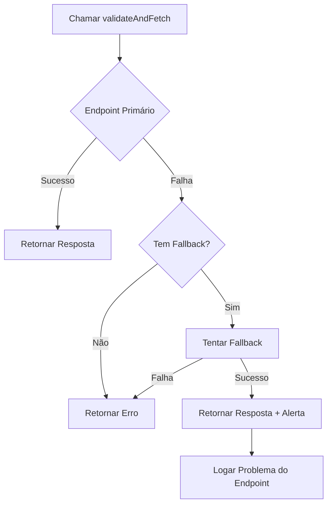

# 🔄 Migração Completa para Validador de Endpoints ML

## ✅ Status: COMPLETO

Todas as chamadas à API do Mercado Livre foram migradas para usar o validador automático de endpoints com fallback.

## 📊 Resumo das Mudanças

### Endpoints Migrados

| Endpoint | Função | Status | Fallback Configurado |
|----------|--------|--------|----------------------|
| **Orders** | Buscar dados da ordem | ✅ Migrado | Nenhum |
| **Shipments** | Buscar dados de envio | ✅ Migrado | Nenhum |
| **Claim Messages** | Buscar mensagens do claim | ✅ Migrado | `/post-purchase/v1/claims/{id}/messages` |
| **Return Details V2** | Buscar detalhes de devolução | ✅ Migrado | `/post-purchase/v1/returns/{id}`, `/marketplace/v2/returns/{id}` |
| **Reviews** | Buscar reviews de devolução | ✅ Migrado | Nenhum |

### Arquivos Modificados

1. **`supabase/functions/_shared/mlEndpointValidator.ts`**
   - ✅ Criado validador automático
   - ✅ Configuração centralizada de endpoints
   - ✅ Sistema de fallback inteligente
   - ✅ Logs detalhados de validação
   - ✅ Alertas automáticos de problemas

2. **`supabase/functions/get-devolucoes-direct/index.ts`**
   - ✅ Todas chamadas migradas para `validateAndFetch()`
   - ✅ Logs expandidos com informações de endpoint usado
   - ✅ Alertas quando fallback é utilizado
   - ✅ Mantida funcionalidade 100% idêntica

## 🎯 Benefícios Implementados

### 1. **Resiliência Automática**
```typescript
// Antes: quebrava se endpoint mudasse
const res = await fetch(`https://api.mercadolibre.com/marketplace/v2/claims/${id}/messages`);

// Depois: tenta fallback automaticamente
const { response, fallbackUsed } = await validateAndFetch('claimMessages', token, { id });
```

### 2. **Monitoramento Proativo**
- 🔍 Detecta quando endpoint primário falha
- ⚠️ Alerta qual fallback foi usado
- 📊 Logs estruturados para análise

### 3. **Manutenção Simplificada**
- Configuração centralizada em um único arquivo
- Fácil adicionar novos endpoints
- Fácil atualizar versões de API

## 🚀 Como Funciona

### Fluxo de Validação



### Exemplo de Uso

```typescript
// Buscar mensagens de um claim
const { response, endpointUsed, fallbackUsed, validationResult } = await validateAndFetch(
  'claimMessages',           // Chave do endpoint
  accessToken,              // Token de autenticação
  { id: claim.id },         // Parâmetros do path
  { 
    retryOnFail: true,      // Tentar fallbacks
    logResults: true        // Logar resultados
  }
);

if (response?.ok) {
  const messages = await response.json();
  
  // Alertar se fallback foi usado
  if (fallbackUsed) {
    console.warn(`⚠️ Endpoint primário falhou! Usando: ${endpointUsed}`);
  }
}
```

## 📝 Configuração de Novos Endpoints

Para adicionar um novo endpoint ao validador:

```typescript
// Em mlEndpointValidator.ts
export const ML_ENDPOINTS = {
  // ... endpoints existentes
  
  novoEndpoint: {
    name: 'Nome Descritivo',
    primary: '/path/principal/{id}',
    fallbacks: ['/path/fallback1/{id}', '/path/fallback2/{id}'],
    method: 'GET' as const,
    requiresAuth: true
  }
};
```

## 🔍 Health Check

Para validar a saúde de todos os endpoints:

```typescript
const healthResults = await validateEndpointHealth(
  accessToken,
  testClaimId  // Opcional, para testar endpoints que precisam de ID
);

// Retorna:
// {
//   claimMessages: { success: true, endpoint: '/marketplace/v2/...', ... },
//   orders: { success: true, endpoint: '/orders/{id}', ... },
//   ...
// }
```

## ⚠️ Alertas e Monitoramento

O sistema agora loga automaticamente:

1. **Quando endpoint primário falha:**
   ```
   ⚠️ [ML Endpoint Validator] Claim Messages falhou (404)
   Endpoint: /marketplace/v2/claims/{id}/messages
   Tentando fallbacks...
   ```

2. **Quando fallback funciona:**
   ```
   ✅ [ML Endpoint Validator] Fallback funcionou!
   ⚠️ IMPORTANTE: Endpoint primário está quebrado
   Considere atualizar para /post-purchase/v1/claims/{id}/messages
   ```

3. **Problema crítico registrado:**
   ```
   🚨 [ML ENDPOINT ISSUE DETECTED]
   {
     endpoint_name: "Claim Messages",
     broken_endpoint: "/marketplace/v2/claims/{id}/messages",
     working_fallback: "/post-purchase/v1/claims/{id}/messages",
     status_code: 404,
     action_required: "UPDATE_ENDPOINT_IN_CODE"
   }
   ```

## 🎓 Lições Aprendidas

### Problema Original
- Endpoint de mensagens mudou de `/post-purchase/v1/` para `/marketplace/v2/`
- Código quebrou silenciosamente
- Colunas de mensagens ficaram vazias
- Difícil detectar e debugar

### Solução Implementada
- Sistema centralizado de configuração
- Validação automática com fallback
- Alertas proativos de problemas
- Logs estruturados e informativos

## 📈 Próximos Passos Recomendados

1. **Dashboard de Saúde** 
   - Criar UI para visualizar status dos endpoints
   - Mostrar quando fallbacks são usados
   - Alertar time de desenvolvimento

2. **Notificações Automáticas**
   - Enviar alertas via webhook quando endpoint primário falha
   - Integrar com sistema de monitoramento existente

3. **Métricas de API**
   - Rastrear taxa de sucesso por endpoint
   - Medir tempo de resposta
   - Identificar padrões de falha

4. **Testes Automatizados**
   - Validar health check em CI/CD
   - Alertar se novos endpoints não têm fallback configurado

## 🔒 Segurança

- ✅ Tokens nunca são logados
- ✅ Apenas informações estruturadas nos logs
- ✅ Validação de autenticação mantida
- ✅ Rate limiting respeitado (via fetchWithRetry)

## 💡 Dicas de Uso

1. **Sempre configure fallbacks** para endpoints críticos
2. **Monitore os logs** para detectar problemas precocemente
3. **Atualize endpoints primários** quando fallbacks são usados frequentemente
4. **Documente mudanças** de versão da API ML

---

**Última atualização:** 2025-11-13  
**Autor:** Sistema Lovable AI  
**Status:** Produção ✅
